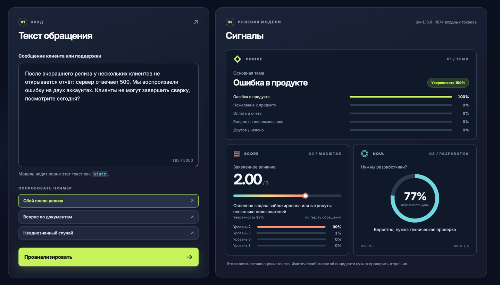

# JEV Lab — разбор обращений поддержки

Небольшое приложение на Kotlin и Spring Boot для знакомства с TypeSafe JEV. Вставьте обращение клиента или заметку поддержки: один запрос к JEV вернёт тему (`Choice`), заявленный масштаб проблемы (`Score`) и вероятность необходимости участия разработчиков (`Noul`). Все инструкции и критерии, которые получает модель, написаны на русском языке.

Страница показывает цветные шкалы и полный JSON, отправленный в TypeSafe и полученный обратно. JSON форматируется для чтения; кнопки копируют точные тела обмена. Ключ остаётся в серверном заголовке `Authorization` и никогда не передаётся браузеру.



## Запуск

Нужен JDK 21 (либо настроенная Gradle toolchain). Из этой папки:

```bash
./gradlew bootRun
```

Если `.env` ещё нет, создайте его по `.env.example` и впишите свой `TYPESAFE_API_KEY` перед запуском. Существующий `.env` сохраняйте: в этой рабочей папке он уже может содержать ваш ключ. Откройте <http://localhost:8099>. `.env` игнорируется Git. Если ключ уже передан через переменную окружения `TYPESAFE_API_KEY`, файл `.env` не нужен. Порт меняется через `PORT`, модель — через `TYPESAFE_MODEL` (по умолчанию `jev-latest`).

## Что именно отправляется

Бэкенд вызывает `POST https://api.typesafe.ai/v1/systemone`. `state` — исходный текст обращения; в `questions` передаются три независимых вопроса. Их формулировки находятся в `prompt/SupportPromptBuilder.kt` и всегда видны на странице в блоке «Отправили». Ответ JEV показан в блоке «Получили», включая `answers`, `model` и `usage`.

Поток вызова: `AnalysisController` проверяет HTTP-вход → `SupportAnalysisAgent` собирает один ход → `SupportPromptBuilder` создаёт JSON → `JevClient` только отправляет его и возвращает сырой ответ. DTO запроса и ответа лежат в `dto/AnalysisDtos.kt`.

Число в `Score` лежит между индексами уровней 0–3 и может быть дробным. Шкала отражает **заявленный** в сообщении масштаб, а не проверенную серьёзность инцидента. `Noul` возвращает вероятность ответа «да»; отдельного поля `confidence` у него нет.

## Проверка API без браузера

```bash
curl -sS http://localhost:8099/api/status
curl -sS -X POST http://localhost:8099/api/analyze \
  -H 'Content-Type: application/json' \
  -d '{"text":"После релиза у двух клиентов ошибка 500 при открытии отчёта."}'
```

Официальная схема: <https://docs.typesafe.ai/api>.
