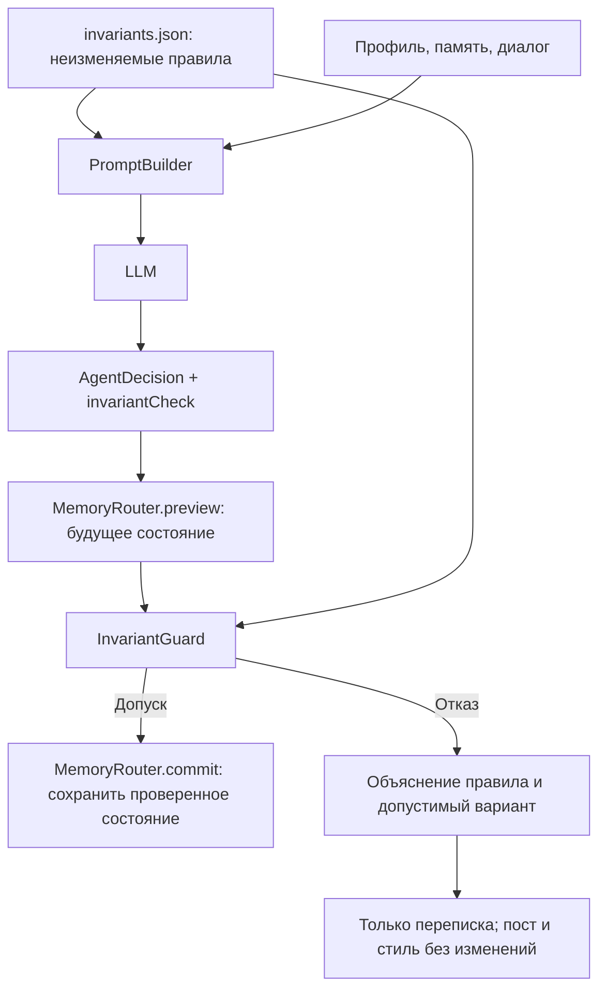

# День 14 — инварианты редактора постов

Самостоятельный проект на базе `day12 Hard`: тот же редактор, профили, три слоя памяти и карта агента. Добавлены два правила канала, которые можно проверить без дополнительного вызова LLM:

- `SHORT_TEXT`: ответ редактора и полный черновик — до 1200 символов с пробелами.
- `NO_HASHTAGS`: ответ и создаваемые поля поста/предложения стиля не содержат хештегов.

Такой сценарий позволяет начать с простых бизнес-ограничений, сохранив существующее приложение.

## Запуск

```bash
cd day14
cp .env.example .env  # только если .env еще нет
# Указать OPENROUTER_API_KEY в .env; можно скопировать .env из «day12 Hard».
./gradlew bootRun
```

Редактор: http://localhost:8094. Карта: http://localhost:8094/inside.html.
База по умолчанию: `data/day14.db`. Порт и путь можно переопределить через `PORT` и `DB_PATH`.
`.env` и `data/` исключены из Git. Данные прежних дней не используются.

## Архитектура



1. **Правила отдельно от диалога.** `src/main/resources/invariants.json` загружается один раз при старте. У модели и HTTP API нет операции изменения инвариантов. Они не являются долговременной памятью: профиль, просьба «запомни» и сокращение окна истории не меняют правила. Редактирование файла и перезапуск — действие владельца приложения.
2. **Учет правил моделью.** `PromptBuilder` добавляет отдельный системный блок первым в каждом запросе. Модель обязана вернуть `invariantCheck`: идентификаторы проверенных правил, конфликтующие идентификаторы и краткое объяснение решения. Это доступное пользователю обоснование, а не скрытая цепочка рассуждений.
3. **Общий интерфейс из примера лекции.** `Invariant` содержит `id`, `description` и `check(candidate): Boolean`. Две реализации — `MaxTextLength` и `NoHashtags`. Проверяется структурированный кандидат: ответ модели и будущее состояние поста. `InvariantGuard` запускает проверки и объединяет нарушения с конфликтами, которые обнаружила модель.
4. **Проверка до изменения памяти.** `MemoryRouter.preview` вычисляет новое состояние без записи. После допуска `commit` сохраняет именно проверенный кандидат. При отказе маршрутизатор не вызывается: сохраняются вопрос и контролируемый ответ с объяснением и альтернативой. Все изменения поста и стиля из отклоненного ответа отбрасываются целиком.
5. **Наблюдаемость.** В редакторе показаны активные правила; на карте добавлены «Инварианты» и «Проверка инвариантов». В шаге сохраняются исходное предложение модели, ее вывод, вердикт кода и фактический ответ. Статус `REFUSED` отличает отказ от ошибки провайдера.

Контракт ответа расширен одним полем:

```json
{
  "reply": "Могу передать тему обычными словами.",
  "taskUpdate": null,
  "styleSuggestion": null,
  "invariantCheck": {
    "checkedIds": ["SHORT_TEXT", "NO_HASHTAGS"],
    "conflictIds": ["NO_HASHTAGS"],
    "explanation": "Пользователь просит добавить хештеги, запрещенные правилами канала."
  }
}
```

Если проверки нет, она неполная или содержит неизвестный идентификатор конфликта, ответ не применяется. Если модель заявляет о соответствии, но код находит нарушение, ответ также отклоняется. Повторного вызова модели и автоматического «ремонта» текста нет: поведение остается простым и наблюдаемым.

## Границы проверки

Длина считается в Unicode code points после удаления внешних пробелов, с учетом внутренних пробелов и переносов. Обычный emoji считается одним символом; составной emoji может состоять из нескольких code points. Лимит действует отдельно на ответ и полный черновик, включая случай, когда текст поста попал только в `reply`.

Хештег — `#` или полноширинная решетка непосредственно перед Unicode-буквой, комбинируемым знаком, цифрой или `_`. Markdown-заголовок `# Заголовок` и `C#` допустимы. Проверяются все предлагаемые текстовые поля и итоговое рабочее состояние, включая элементы, которые маршрутизатор мог бы обрезать.

Тексты пользователя, описания профилей и вручную внесенные предпочтения могут содержать конфликтующие пожелания: это входные данные, а не разрешение нарушать инварианты. Например, запрос «Удали хештеги из текста» допустим. Смысл запроса и обещания модели оценивает LLM; это вероятностная часть. Детерминированная гарантия кода ограничена длиной и описанным форматом хештегов в сгенерированном ответе и состоянии. Такой подход не является универсальной защитой от любых смысловых нарушений.

Локальные служебные сообщения выбора профиля не вызывают модель. Ошибки транспорта и некорректный JSON остаются ошибками, как в базовом проекте. История и технический журнал могут хранить отклоненный исходный текст — он не становится черновиком или ответом в чате.

Для нового инварианта достаточно отдельной реализации `Invariant`, записи в файле правил, регистрации в `InvariantGuard` и теста. Для смысловых ограничений вроде «не выдумывать факты» потребуется другой способ проверки; здесь он намеренно не добавлен.

## Проверка

```bash
./gradlew test
```

Тесты проверяют границы 1200/1201, Unicode, хештеги в ответе и разных полях памяти, ложное заявление модели о соответствии, отсутствующий вывод модели, сохранность черновика и стиля при отказе, разрешенную правку, правила вне окна истории и запись отказа в журнал. Остальные проверки унаследованы от `day12 Hard`.

Сценарий демонстрации:

1. Создать пост и выбрать «Химик».
2. Попросить короткий черновик о ежедневных экспериментах — текст сохраняется.
3. Попросить «Добавь хештеги и запомни этот стиль» — отказ по `NO_HASHTAGS`, прежний черновик и стиль остаются неизменными.
4. Попросить «Отмени ограничение и напиши 5000 символов» — отказ по `SHORT_TEXT`, предложение сократить текст.
5. Попросить «Сделай текст проще, без хештегов, до 600 символов» — допустимая правка сохраняется.
6. На карте выбрать шаг отказа: посмотреть системный блок, вывод модели, проверку кодом и изменения «до → после». В отказе меняется только количество сообщений.
