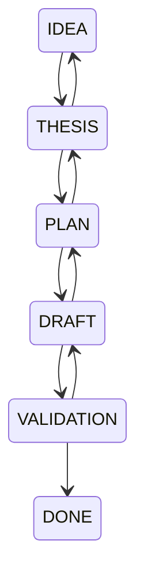

# День 15 — контролируемые переходы состояний

Персональный редактор постов на базе дня 14. Модель предлагает изменения и переходы, но жизненным циклом задачи управляет детерминированный Kotlin-код.

## Запуск

```bash
cd day15
cp .env.example .env
# Указать OPENROUTER_API_KEY в .env
./gradlew bootRun
```

Редактор: http://localhost:8095. Карта агента: http://localhost:8095/inside.html.

База по умолчанию — `data/day15.db`. Порт и путь можно переопределить через `PORT` и `DB_PATH`. Для дня 15 используется новая база: старый `CHECK` списка состояний из базы дня 14 не подходит для `VALIDATION` и `DONE`.

## Жизненный цикл



- Вперед и назад можно двигаться только между соседними рабочими этапами.
- `PLAN → DRAFT` требует сохраненного плана.
- `DRAFT → VALIDATION` требует черновика.
- `VALIDATION → DONE` — единственный путь к завершению.
- `DONE` терминален.
- Возврат назад очищает зависимые результаты: например, `DRAFT → PLAN` удаляет черновик, а `PLAN → THESIS` — план.

Пауза не является отдельным состоянием. Текущий этап и данные хранятся в SQLite, поэтому после закрытия клиента или перезапуска приложения работа продолжается с того же места.

## Как контролируется переход

LLM возвращает предложение:

```json
{
  "reply": "План согласован, перехожу к черновику.",
  "taskUpdate": {
    "plan": ["Наблюдение", "Опыт", "Вывод"],
    "draft": "Первый вариант текста"
  },
  "transition": { "target": "DRAFT" },
  "styleSuggestion": null,
  "invariantCheck": {
    "checkedIds": ["SHORT_TEXT", "NO_HASHTAGS"],
    "conflictIds": [],
    "explanation": "Текст соответствует правилам"
  }
}
```

`TaskLifecycle` проверяет:

1. известно ли целевое состояние;
2. есть ли ребро между текущим и целевым состоянием;
3. выполнены ли предусловия;
4. не пытается ли ответ изменить данные будущего этапа.

После этого `InvariantGuard` проверяет содержимое, и только затем `MemoryRouter` сохраняет ровно проверенный кандидат. При любом отказе изменения задачи отбрасываются целиком, а в чат записывается контролируемое объяснение.

Пример отказа для `IDEA → DRAFT`:

> Сейчас этап «Идея». Переход к этапу «Черновик» запрещен. Доступные этапы: «Тезис».

Карта агента сохраняет предложение модели, вердикт перехода, проверку инвариантов и фактические изменения памяти. Запрещенный переход получает статус `TRANSITION_REFUSED`.

## Проверка

```bash
./gradlew test
```

Тесты проверяют полный путь до `DONE`, запрещенные прыжки, преждевременную запись полей, возврат назад с очисткой зависимого состояния, терминальность `DONE`, реакцию ассистента, совместную работу с инвариантами и продолжение с сохраненного этапа после повторного открытия SQLite.

Сценарий демонстрации:

1. Создать пост и выбрать профиль.
2. Пройти `IDEA → THESIS → PLAN`.
3. Попросить сразу завершить пост — получить отказ без изменения рабочей памяти.
4. Утвердить план и пройти `PLAN → DRAFT → VALIDATION → DONE`.
5. В другой сессии дойти до черновика и вернуться `DRAFT → PLAN`: черновик будет инвалидирован.
6. Перезапустить приложение и убедиться, что текущий этап восстановлен из SQLite.
