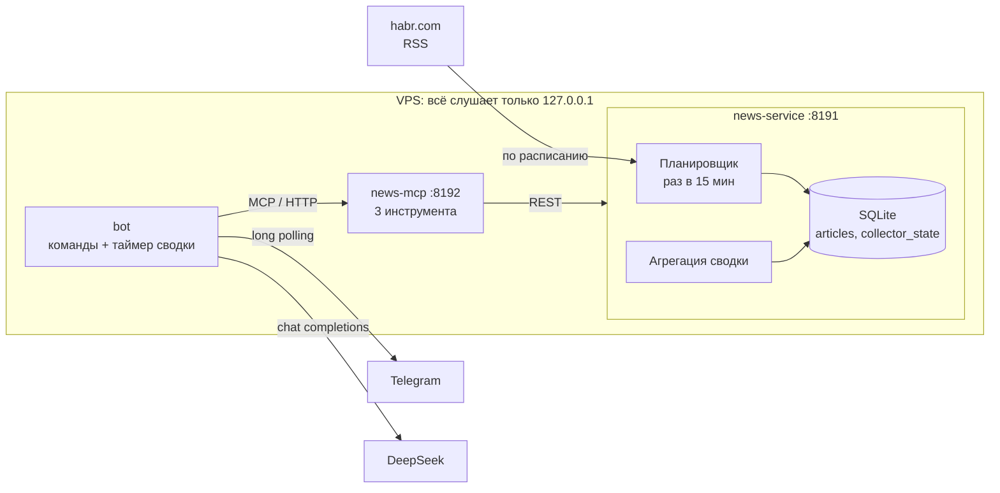

# День 18 в облаке — дайджест Хабра в Telegram

Тот же день 18, что и в [`day18`](../day18): MCP-инструмент с периодическим выполнением и агент,
который работает 24/7 и сам присылает сводку. Отличие в том, что эта версия рассчитана на маленький
VPS (1 ядро, 2 ГБ памяти) и с ней общаются через Telegram, а не через консоль.

Что упрощено по сравнению с `day18`:

| | day18 | day18-cloud |
|---|---|---|
| Источники | ТАСС, Интерфакс, РБК, Хабр и темы через Google News | только Хабр |
| Подписки | заводятся из чата, у каждой свой интервал | нет: лента одна, интервал в конфиге |
| API | 6 запросов | 3: статус, включить/выключить, сводка |
| MCP-инструменты | 6 | 3: `news_status`, `news_set_enabled`, `news_digest` |
| Интерфейс | консольный агент со свободным чатом | Telegram-бот с командами |
| Выкладка | Docker Compose, сборка в контейнере | jar-ы собираются локально, на сервере systemd |

Google News убран не только ради простоты: с российского VPS он просто не открывается.



| Модуль | Что это | Память на сервере |
|---|---|---|
| `news-service` | Spring Boot: планировщик, RSS Хабра → SQLite, REST API | ~210 МБ (`-Xmx160m`) |
| `news-mcp` | MCP-сервер на Streamable HTTP поверх того же REST API | ~110 МБ (`-Xmx64m`) |
| `bot` | Telegram-бот: команды → инструменты MCP, текст сводки пишет DeepSeek | ~110 МБ (`-Xmx64m`) |

Всего около 450 МБ из 2 ГБ. Стек тот же, что в `day18`: Kotlin, Spring Boot и Ktor. Памяти не хватало
не из-за стека, а из-за того, что образы пришлось бы собирать Gradle-ом прямо на сервере. Теперь сборка
идёт на своей машине, а на сервер попадают готовые jar-ы. Они не зависят от архитектуры, поэтому
собранное на Mac с arm64 работает на x86-сервере.

---

## Как это устроено

### Сбор по расписанию

Раз в минуту планировщик сверяет `last_run_at` из таблицы `collector_state` с `NEWS_EVERY` (по умолчанию
15 минут) и, если подошёл срок, забирает ленту `habr.com/ru/rss/articles/?limit=100`. Повторы отсекает
`UNIQUE (link)` через `INSERT OR IGNORE`, число вставленных строк — это «сколько новых».

Флаг «сбор включён» тоже живёт в базе. Выключенный через бота сбор остаётся выключенным и после
перезапуска сервиса. При включении сервис сразу делает сбор, не дожидаясь расписания.

Из RSS Хабра берётся больше, чем просто заголовок: автор (`dc:creator`), теги (`category`) и первые
300 символов статьи из `description` без HTML. Без начала текста модель по заголовку вроде
«Чем отличается менеджер проектов от менеджера проектов» не поймёт, куда статью отнести.
В качестве ссылки берётся `guid`: в нём чистый адрес без utm-меток.

### API

| Запрос | Что делает |
|---|---|
| `GET /api/status` | Включён ли сбор, когда был последний и что принёс, когда следующий, сколько статей в базе |
| `PUT /api/enabled` `{"enabled": true}` | Включить или выключить сбор. При включении сразу делает сбор |
| `GET /api/digest?minutes=1440` | Сводка за период: сколько статей, частые теги, статьи новыми сверху |
| `GET /api/digest?afterId=123` | То же, но всё, что собрано после курсора прошлой сводки |

Интервалы и срок хранения в API не меняются: они задаются в конфиге и применяются после перезапуска.

### Сводка: номера вместо ссылок

`news_digest` отдаёт модели пронумерованный список: `[1] 13:02 · Заголовок · автор · теги` и под ним
начало статьи. Модель пишет дайджест с эмодзи-рубриками и ссылается на статьи номерами: `• … [4][9]`.
Потом бот сам превращает `[4]` в ссылку на четвёртую статью из `structuredContent` того же ответа.

Так модель физически не может исказить или выдумать адрес, а сообщение в Telegram не превращается
в простыню URL-ов. Номер, которого нет в списке, остаётся обычным текстом. Итоговую строку `📊`
с числом статей и тегами печатает код, а не модель.

### Сводки встык: курсор

Сводка по таймеру берёт не «последние N минут по времени публикации», а всё, что собрано после прошлой
сводки (`after_id`). Почему это важно, разобрано в README дня 18: иначе статья, которую лента отдала
с опозданием, не попадает ни в одну сводку.

В `day18` курсор жил в памяти агента. Здесь бота перезапускают при каждой выкладке, поэтому курсор
сохраняется в файл `digest-cursor.txt` (на сервере в `/var/lib/habr-digest-bot`). Если новых статей нет
или сбор выключен, бот ничего не присылает: пустые сообщения каждые два часа только мешали бы.
Если DeepSeek не ответил, курсор не двигается, и эти статьи войдут в следующую сводку.

### Бот

| Команда | Инструмент MCP |
|---|---|
| `/digest`, `/digest 6` | `news_digest` за 24 или 6 часов → DeepSeek → дайджест |
| `/status` | `news_status` |
| `/on`, `/off` | `news_set_enabled` |
| каждые `DIGEST_EVERY_MINUTES` | `news_status`, затем `news_digest` по курсору → DeepSeek → дайджест |

Модель тут не выбирает, какой инструмент вызвать: команда однозначно задаёт инструмент. DeepSeek нужен
только для того, чтобы написать текст сводки.

Сообщения бот получает через long polling: сам спрашивает у Telegram `getUpdates` и ждёт до 50 секунд.
Webhook потребовал бы открытого порта, домена и TLS-сертификата, а для long polling хватает исходящего HTTPS.

---

## Запуск локально

Нужен JDK 21. Сначала заполнить `.env` по образцу `.env.example`: ключ DeepSeek и токен бота
(как его получить — ниже).

```bash
cd day18-cloud
./gradlew :news-service:bootRun                                   # порт 8191, база в data/news.db
set -a; . ./.env; set +a; ./gradlew :news-mcp:run                 # порт 8192, в другом терминале
./gradlew :bot:run                                                # бот, в третьем терминале
```

MCP-серверу токен нужен из окружения, поэтому перед его запуском `.env` загружается через `set -a`.
Бот читает `.env` сам.

## Telegram-бот: как получить токен и chat id

1. В Telegram открыть [@BotFather](https://t.me/BotFather), отправить `/newbot`, придумать имя
   и username, который заканчивается на `bot`.
2. BotFather пришлёт токен вида `123456789:AA…`. Его нужно вписать в `.env` как `TELEGRAM_BOT_TOKEN=…`.
3. Запустить бота с пустым `TELEGRAM_CHAT_ID` и написать ему `/start`. В режиме настройки бот
   ответит твоим chat id и больше ничего делать не будет.
4. Вписать его в `.env` как `TELEGRAM_CHAT_ID=…` и перезапустить бота.

## Выкладка на VPS

```bash
./deploy/deploy.sh user@host          # собрать, залить, перезапустить
./deploy/deploy.sh user@host --env    # то же и обновить секреты на сервере из .env
```

Скрипт собирает три jar-а, копирует их вместе с юнитами на сервер, при первом запуске ставит
`openjdk-21-jre-headless`, кладёт `.env` в `/etc/habr-digest/habr-digest.env` с правами `600`,
включает и перезапускает сервисы. Docker на сервере не нужен.

```bash
ssh user@host journalctl -fu habr-bot                 # лог бота
ssh user@host journalctl -fu habr-news-service        # лог сборщика
ssh -L 8191:localhost:8191 -L 8192:localhost:8192 user@host   # API и MCP с локальной машины
```

Через туннель MCP-сервер можно подключить к Claude Code как `http://localhost:8192/mcp`
с заголовком `Authorization: Bearer <MCP_AUTH_TOKEN>`.

## Настройки

| Переменная | Кто читает | По умолчанию | Что это |
|---|---|---|---|
| `DEEPSEEK_API_KEY` | бот | — | Ключ DeepSeek |
| `TELEGRAM_BOT_TOKEN` | бот | — | Токен от @BotFather |
| `TELEGRAM_CHAT_ID` | бот | не задан | Единственный чат, которому бот отвечает; пусто — режим настройки |
| `DIGEST_EVERY_MINUTES` | бот | `120` | Как часто бот сам присылает сводку, 1..1440 |
| `MCP_AUTH_TOKEN` | бот, news-mcp | не задан | Токен `Authorization: Bearer` для `/mcp` |
| `NEWS_EVERY` | news-service | `15m` | Как часто забирать ленту |
| `NEWS_RETENTION` | news-service | `30d` | Сколько хранить статьи |
| `DEEPSEEK_MODEL` | бот | `deepseek-chat` | Модель |
| `MCP_URL` | бот | `http://localhost:8192/mcp` | Адрес MCP-сервера |

## Безопасность

- **Наружу не открыто ничего.** Сервис и MCP слушают `127.0.0.1`, бот сам ходит к Telegram.
  Снаружи на сервере открыт только SSH, а к API подключаются через SSH-туннель.
- **Бот отвечает только владельцу.** Сообщения из чужих чатов пропускаются, иначе любой, кто найдёт
  бота в поиске, тратил бы ключ DeepSeek.
- **Секреты.** Лежат в `/etc/habr-digest/habr-digest.env` с правами `600`, владелец root. Сервисы
  получают их через `EnvironmentFile` systemd. Токен бота — часть адреса Bot API, поэтому из сообщений
  об ошибках сети он вырезается до того, как попасть в лог.
- **Изоляция.** Каждый сервис работает под своим временным пользователем (`DynamicUser`), файловая
  система для них только на чтение (`ProtectSystem=strict`), кроме своего каталога в `/var/lib`.
  Память ограничена `MemoryMax`, при OutOfMemory JVM выходит, и systemd её перезапускает.
- **SSRF и XXE.** Адрес ленты фиксирован в `application.yml`. RSS разбирается с выключенными DTD
  и внешними сущностями, читается не больше 5 МБ, в сводку попадают только ссылки `http(s)://`.
- **HTML в Telegram.** Ответ модели и заголовки экранируются до того, как в них подставляются ссылки.
- **Промпт-инъекции.** В промпте сказано, что заголовки и тексты статей — данные, а не инструкции.
  К тому же у модели нет инструментов: она только пишет текст.

## Ограничения

- Разбирается только RSS 2.0 — Хабр отдаёт ленту в нём.
- Интервалы меняются только через конфиг и перезапуск: так и задумано, чтобы API был минимальным.
- Таймер сводок отсчитывается от запуска бота: после выкладки следующая сводка придёт через
  `DIGEST_EVERY_MINUTES`. Курсор при этом сохраняется, и статьи не теряются.
