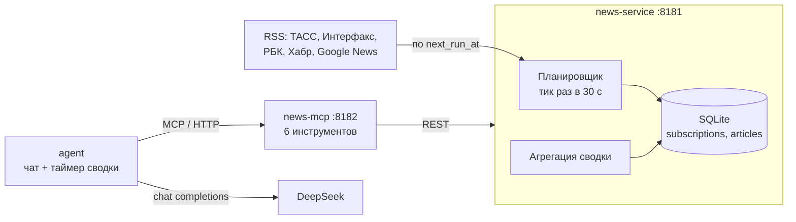

# День 18 — планировщик и фоновые задачи

Задание дня: сделать MCP-инструмент с отложенным или периодическим выполнением. Инструмент
сохраняет данные, работает по расписанию и возвращает агрегированный результат. Итог — агент,
который работает 24/7 и периодически выдаёт сводку.

Здесь это **новостной агент**. В чате ему говорят «подпишись на ТАСС раз в 5 минут и следи
за темой „ключевая ставка“». Дальше сервер сам, по расписанию, забирает ленты и складывает
новости в SQLite, а агент раз в N минут выдаёт сводку с эмодзи-рубриками.

| Модуль | Что это | Знает про MCP |
|---|---|---|
| `news-service` | Spring Boot: планировщик, RSS-ленты → SQLite, REST API подписок и сводки | нет |
| `news-mcp` | MCP-сервер на Streamable HTTP: шесть инструментов поверх того же REST API | да |
| `agent` | Консольный агент: чат с DeepSeek через MCP и сводка по таймеру | да |

Разделение то же, что в днях 16 и 17: бизнес-сервис не переписывается под модели,
MCP — тонкий слой поверх уже существующего API.



## Запуск

Нужен JDK 21. Сервису новостей и MCP-серверу ключи не нужны, агенту нужен ключ DeepSeek
в `day18/.env` (образец — `.env.example`).

```bash
cd day18
./gradlew :news-service:bootRun    # порт 8181, база в day18/data/news.db
./gradlew :news-mcp:run            # порт 8182, в другом терминале
./gradlew :agent:run               # агент, в третьем терминале
```

Для демо удобно выставить в `.env` `DIGEST_EVERY_MINUTES=2`: сводка будет приходить каждые две минуты.

---

## Как это устроено

### Расписание живёт в базе

Подписка — это задание для планировщика: что забирать и как часто. У каждой подписки в таблице
`subscriptions` есть `next_run_at`. Раз в `news.tick` (30 секунд) планировщик просыпается,
берёт подписки, которым пора, скачивает их ленты и записывает итог: `last_run_at`, сколько
пришло нового, ошибку, если была, и новый `next_run_at`.

Отсюда три свойства, ради которых всё так устроено:

- **Перезапуск ничего не теряет.** В памяти расписания нет: сервис поднимается, читает
  `next_run_at` и продолжает с того же места.
- **Интервал у каждой подписки свой.** ТАСС можно забирать раз в минуту, Хабр — раз в час,
  и для этого не нужен отдельный таймер на каждую ленту.
- **Первый сбор делается сразу при подписке.** Поэтому сводку можно просить сразу после подписки,
  не дожидаясь первого тика.

Новости пишет планировщик, а не агент: агента можно остановить на ночь, и утренняя сводка
всё равно соберётся из того, что сервер накопил за это время.

### Хранилище

SQLite, две таблицы — `schema.sql`:

| Таблица | Что в ней |
|---|---|
| `subscriptions` | Лента (`feed`, ключ каталога) или тема (`topic`, поисковый запрос); интервал; итог последнего сбора |
| `articles` | Издание, заголовок, ссылка, время публикации и сбора. `UNIQUE (subscription_id, link)` |

Лента при каждом сборе отдаёт почти те же 30–100 новостей, что и в прошлый раз. Повторы отсекает
ограничение `UNIQUE` через `INSERT OR IGNORE`, а не проверка в коде, и число реально вставленных
строк и есть «сколько новых». Старше `news.retention` (7 дней) новости удаляются на каждом тике:
агент работает 24/7, и без чистки база росла бы бесконечно.

### Агрегация: что делает код, а что — модель

`news_digest` возвращает уже посчитанный результат:

- **total** — сколько уникальных новостей. Одна новость может прийти дважды: из ленты ТАСС
  и из темы, которую нашёл Google News. Такая считается один раз, но в ней помнятся все издания и темы.
- **bySource / bySubscription** — разбивка по изданиям и по подпискам.
- **headlines** — заголовки без повторов, новые сверху, не больше `limit`.
- **cursor** — откуда начнётся следующая сводка (о нём ниже).

Считает код: пересчитывать сотню строк на глаз модели не нужно, а ошибиться она может.
Модели остаётся то, чего код не умеет, — понять смысл, разложить по рубрикам и найти сюжеты,
о которых написали несколько изданий. Итоговую строку `📊` под сводкой тоже печатает код,
по `structuredContent`, а не модель.

### Сводки по таймеру идут встык: курсор

Первая версия считала период по времени публикации: сводка каждые 30 минут — новости,
опубликованные за последние 30 минут. Живой прогон показал, что так новости теряются.
Лента отдаёт новость с опозданием в 1–5 минут: опубликованная в 16:29 и собранная в 16:31,
она не попадает ни в сводку 16:00–16:30 (её ещё нет в базе), ни в следующую (по времени она раньше).

Поэтому у `news_digest` два способа задать период:

| Параметр | Смысл | Кто пользуется |
|---|---|---|
| `minutes` | Что **опубликовано** за последние N минут | Чат: «что было за час» |
| `after_id` | Что **собрано** после прошлой сводки | Таймер агента |

`cursor` — это id последней записанной новости. id растёт в порядке записи (`AUTOINCREMENT`,
одно соединение с базой), поэтому «всё, что id > курсора» — ровно то, что появилось после
прошлой сводки. Каждая новость попадает ровно в одну сводку, и часы для этого не нужны.
Первая сводка после старта агента берёт последние N минут и получает курсор, дальше таймер
идёт по курсору. Если модель не ответила, курсор не сдвигается, и эти новости войдут в следующую сводку.

### Агент: чат и таймер в одной консоли

- **Чат** — обычный agent loop из дня 17. Модель сама решает, какой инструмент звать.
  В начало каждого сообщения подставляется текущее время: агент живёт сутками, и без этого
  модель не поймёт, сколько минут в «за утро».
- **Таймер** — agent loop не нужен: какой инструмент звать и с какими аргументами, известно
  заранее. Поэтому `news_digest` вызывается напрямую из кода, а модель только пишет текст.
  Если за период новостей нет, запрос к модели не делается.
- **Общая консоль.** Печатает кто-то один: сводка, пришедшая во время ответа, ждёт его конца,
  а сводка, пришедшая, пока человек думает над вопросом, печатается и возвращает приглашение «Вы:».
- **Контекст не пухнет.** Сводка — это тысячи токенов заголовков. После ответа сырой результат
  инструмента в истории обрезается до начала: сам ответ остаётся, поэтому переспросить
  «подробнее про второй пункт» можно, а контекст за сутки не переполняется.
- **Без терминала агент не падает.** Если ввод закрыт (фон, контейнер без `attach`), чат
  выключается, а сводки продолжают выходить по таймеру.

### Эмодзи в сводках

Рубрики фиксированы, чтобы от сводки к сводке одна и та же рубрика выглядела одинаково:
🔥 Главное · 🌍 В мире · 🇷🇺 Россия · 💰 Экономика и финансы · 💻 Технологии и IT · 🔬 Наука ·
🏥 Здоровье · ⚽ Спорт · 🎭 Культура · 🚨 Происшествия · 🔎 Тема из подписки.
Markdown модели запрещён: сводка читается в терминале, и `**` там — просто звёздочки.
Правила общие для чата и таймера (`Prompts.kt`), поэтому сводка выглядит одинаково,
кто бы её ни попросил.

---

## MCP-инструменты

| Инструмент | Аргументы | Что делает |
|---|---|---|
| `list_sources` | — | Каталог лент, на которые можно подписаться |
| `subscribe_feed` | `source`*, `every_minutes` | Подписка на ленту: первый сбор сразу, дальше по расписанию. Повтор меняет интервал |
| `subscribe_topic` | `query`*, `every_minutes` | Подписка на тему через Google News за последние сутки |
| `list_subscriptions` | — | Подписки с расписанием: последний и следующий сбор, сколько нового, ошибки |
| `unsubscribe` | `subscription_id`* | Удалить подписку вместе с её новостями (`destructiveHint: true`) |
| `news_digest` | `minutes` или `after_id`, `query`, `subscription_id`, `limit`, `with_links` | Агрегированная сводка: текст для модели + `structuredContent` для кода |

`query` в `news_digest` ищет слово, начинающееся с этого текста: `ИИ` найдёт «ИИ-ассистент»,
но не «России», а `трамп` найдёт «Трампа».

Транспорт, режим stateless, токен и защита от DNS rebinding — как в дне 17.

```bash
curl -s http://localhost:8182/mcp \
  -H 'Content-Type: application/json' \
  -H 'Accept: application/json, text/event-stream' \
  -H 'MCP-Protocol-Version: 2025-06-18' \
  -d '{"jsonrpc":"2.0","id":1,"method":"tools/call","params":{"name":"news_digest","arguments":{"minutes":30,"limit":5}}}'
```

## REST API сервиса новостей

| Метод | Назначение |
|---|---|
| `GET /api/sources` | Каталог лент |
| `GET /api/subscriptions` | Подписки с расписанием и итогом последнего сбора |
| `POST /api/subscriptions/feeds` | `{"source": "tass", "everyMinutes": 5}` → 201 новая, 200 уже была |
| `POST /api/subscriptions/topics` | `{"query": "ключевая ставка", "everyMinutes": 10}` |
| `DELETE /api/subscriptions/{id}` | 204, или 404, если такой нет |
| `GET /api/digest?minutes=60` или `?afterId=1234` | Сводка; `query`, `subscriptionId`, `limit` — необязательно |

Swagger — http://localhost:8181/swagger. Ошибки приходят как `{"message": "..."}`: 400 — неизвестная
лента (со списком доступных), интервал вне 1..1440, одновременно `minutes` и `afterId`; 404 — нет подписки.

## Настройка

| Переменная | Где | По умолчанию | Зачем |
|---|---|---|---|
| `DEEPSEEK_API_KEY` | агент | — | Ключ DeepSeek, обязателен |
| `DIGEST_EVERY_MINUTES` | агент | `30` | Как часто агент сам выдаёт сводку |
| `MCP_URL` | агент | `http://localhost:8182/mcp` | Адрес MCP-сервера |
| `MCP_AUTH_TOKEN` | агент, news-mcp | не задан | Токен `Authorization: Bearer`; в compose обязателен |
| `NEWS_API_URL` | news-mcp | `http://localhost:8181` | Адрес сервиса новостей |
| `MCP_ALLOWED_HOSTS` | news-mcp | `localhost,127.0.0.1,[::1]` | Допустимые значения `Host` |
| `NEWS_TICK` | news-service | `30s` | Как часто планировщик проверяет расписание |
| `NEWS_RETENTION` | news-service | `7d` | Сколько хранить новости |
| `DB_PATH` | news-service | `data/news.db` | Файл SQLite |

Каталог лент — блок `news.sources` в `application.yml`.

## 24/7 в Docker

```bash
cd day18
echo "MCP_AUTH_TOKEN=$(openssl rand -hex 32)" >> .env   # ключ DeepSeek там уже есть
docker compose up --build -d

docker compose logs -f agent          # сводки по таймеру
docker attach day18-agent-1           # чат; отключиться, не останавливая: Ctrl-P, Ctrl-Q
```

Все три сервиса с `restart: unless-stopped`. Наружу опубликован только MCP-сервер (8182), сервис
новостей доступен лишь внутри сети compose. База — на томе `news-db` и переживает пересборку.
Время в сводках — в поясе `TZ` (по умолчанию `Europe/Moscow`), в базе и API оно в UTC.

## Безопасность

- **SSRF.** Модель не передаёт URL. Подписаться можно только на ленты из каталога
  в `application.yml`, а адрес Google News собирает код; от модели туда попадает только
  текст запроса, закодированный в URL. Иначе через `subscribe_feed` сервер можно было бы
  заставить сходить куда угодно, в том числе во внутреннюю сеть compose.
- **XXE.** RSS — это XML с чужого сервера. Парсер (StAX) работает с выключенными DTD и внешними
  сущностями, поэтому лента не может заставить сервер прочитать локальный файл.
- **Размер и время.** Лента читается не больше 5 МБ, таймаут 15 секунд, в ленте не больше 300 новостей.
- **Ссылки.** В базу попадают только `http(s)://`: `javascript:` и прочие схемы отбрасываются.
- **Промпт-инъекции.** Заголовки пишут чужие люди, и они попадают прямо в промпт. В обоих
  промптах сказано, что это данные, а не инструкции. Удалить подписку модель может только явным
  `unsubscribe`, и промпт велит переспросить, если непонятно, какую подписку убрать.
- **Доступ к MCP.** Токен обязателен в compose, сравнивается за постоянное время — как в дне 17.

## Ограничения

- Разбирается только RSS 2.0: в этом формате отдают ленты все источники каталога и Google News. Atom не поддержан.
- Ссылки Google News — редиректы вида `news.google.com/rss/articles/…`: адрес статьи Google в ленте не отдаёт.
- Курсор сводки агент держит в памяти. После перезапуска агента первая сводка снова берёт
  последние N минут по времени публикации.
