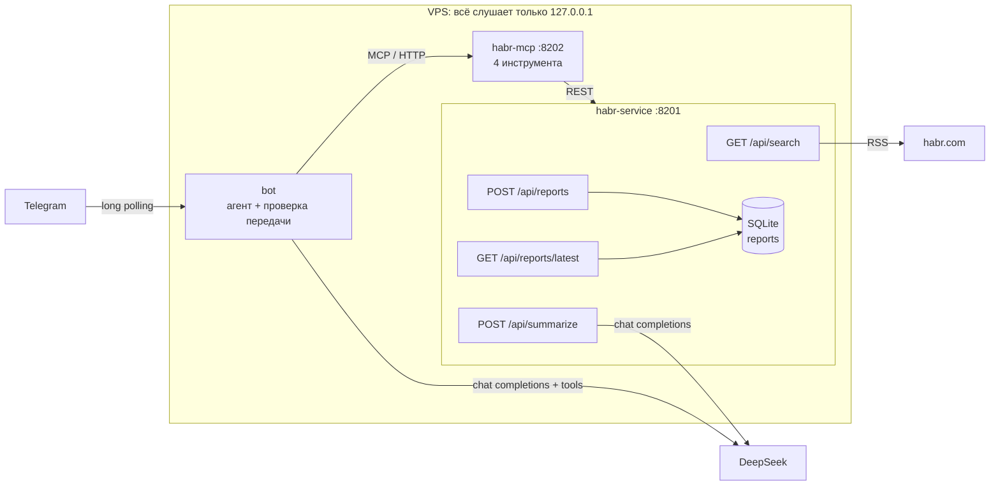

# День 19 — композиция MCP-инструментов

Задание дня: сделать несколько MCP-инструментов и собрать из них автоматический конвейер. Первый
инструмент получает данные, второй обрабатывает, третий сохраняет результат. Проверить, что цепочка
выполняется сама и что данные доходят от шага к шагу без искажений.

Здесь это **агент дайджеста Хабра в Telegram**. Пишешь ему «собери свежую сводку» или «что пишут про
RAG», и он сам проходит три шага: 🔎 поиск → 🧠 сводка → 💾 сохранение. На «покажи последнюю
сводку» агент достаёт сохранённый отчёт. Под каждым шагом бот пишет, дошли ли данные до следующего
шага без изменений.

| Модуль | Что это | Знает про MCP |
|---|---|---|
| `habr-service` | Spring Boot: поиск по RSS Хабра, сводка через DeepSeek, отчёты в SQLite | нет |
| `habr-mcp` | MCP-сервер на Streamable HTTP: четыре инструмента поверх того же REST API | да |
| `bot` | Telegram-бот с агентом: DeepSeek сам вызывает инструменты MCP по цепочке | да |

Разделение то же, что в днях 16–18: бизнес-сервис не переписывается под модели, а MCP — тонкий слой
поверх уже существующего API.



## Запуск

Нужен JDK 21 и `day19/.env` по образцу `.env.example`: ключ DeepSeek, токен бота и `chat_id`.

```bash
cd day19
./gradlew :habr-service:bootRun                              # порт 8201, база в day19/data/reports.db
(set -a; . ./.env; set +a; ./gradlew :habr-mcp:run)          # порт 8202, в другом терминале
./gradlew :bot:run                                           # Telegram-бот, в третьем
```

MCP-сервер читает `MCP_AUTH_TOKEN` только из окружения, поэтому `.env` подключается перед запуском.
Если токен не задан, `/mcp` отвечает без проверки доступа. Так можно только локально.

Проверить конвейер без Telegram можно одним вопросом из терминала:

```bash
./gradlew :bot:run --args='--ask Собери свежую сводку по теме Kotlin'
```

---

## Как это устроено

### Шаги конвейера — обычный REST API

| Запрос | Шаг | Вход | Выход |
|---|---|---|---|
| `GET /api/search?query=RAG&limit=10` | получить данные | тема (не задана — свежая лента), 1–15 статей | `items[]`: id, заголовок, ссылка, автор, дата, теги, начало текста |
| `POST /api/summarize` | обработать | `{query?, items[]}` — статьи целиком | `{summary, sources[], received, cited}` |
| `POST /api/reports` | сохранить | `{query?, summary, sources[]}` | отчёт с номером и временем |
| `GET /api/reports/latest` | — | — | последний сохранённый отчёт |

`id` статьи — её номер на Хабре из адреса (`…/articles/1082364/`). Сводка ссылается на статьи этими
номерами: `• Как ускорить сборку Gradle [1082364]`. Бот при показе превращает номер в короткую ссылку `[3]`.

Ошибки приходят в виде `{"message": "..."}`:

| Код | Когда |
|---|---|
| 400 | Нет обязательного поля, `limit` вне 1..15, ссылка не `http(s)`, повторяются id, сводка ссылается на статью, которой нет в `sources` |
| 404 | Отчётов ещё нет |
| 502 | Хабр или DeepSeek не ответили |

### Данные передаются целиком, а не ссылками

Каждый шаг получает на вход всё, что ему нужно. `summarize` принимает сами статьи, а не id прошлого
поиска, `save` — готовый текст и источники. Шаги ничего не знают друг о друге. Сейчас они живут
в одном сервисе, но любой можно вынести в отдельный, не трогая остальные: `summarize` всё равно,
откуда пришли статьи.

Цена такого решения — данные между шагами несёт модель. Агент получает результат `habr_search`
и сам переписывает статьи в аргументы `habr_summarize`, затем текст сводки и источники — в аргументы
`report_save`. По дороге модель может что-то сократить, перепутать или выдумать. Поэтому:

- **Бот сверяет каждую передачу.** Он видит и то, что вернул инструмент, и то, что модель передала
  дальше, и сравнивает их поле за полем:

  ```
  🔎 habr_search «Kotlin» → 8 статей
  🧠 habr_summarize ← 8 из 8 статей ✅ дошли без изменений
      → сводка ссылается на 8
  💾 report_save ← текст ✅, источники ✅ 8
      → отчёт #3
  ```

  Если что-то не сошлось, строка показывает, что именно, с какого символа и какими кодами:
  `⚠️ изменено 1 (1077948: title с символа 5: «‑weight LLM» → «-weight LLM» (U+2011 → U+002D))`.
  Бот ничего не блокирует: задача проверки — сделать искажение видимым.
- **Сервис проверяет вход.** `save` отвергает сводку, которая ссылается на статью без источника: это
  признак того, что `summary` и `sources` пришли от разных вызовов. Ссылки должны быть `http(s)`,
  id — номерами статей без повторов.
- **Объёмы ограничены.** Не больше 15 статей, от каждой около 400 символов текста. Длинный список
  модель переписывает хуже.

Первый же прогон показал, зачем это нужно. В двух статьях из восьми модель «исправила» заголовок:
заменила неразрывный пробел `U+00A0` и неразрывный дефис `U+2011`, которыми Хабр расставляет
типографику, на обычные. Глазом разницы не видно, а побайтово это другие данные. Теперь поиск приводит
такие символы к обычным сам, у источника. Любое другое изменение проверка ловит по-прежнему.

### Инструменты MCP

| Инструмент | Что делает | Аннотации |
|---|---|---|
| `habr_search` | Шаг 1: статьи по теме или свежая лента | read-only, open world |
| `habr_summarize` | Шаг 2: сводка по переданным статьям | read-only, open world (DeepSeek) |
| `report_save` | Шаг 3: сохранить сводку как отчёт | пишет в базу, не идемпотентный |
| `report_latest` | Последний сохранённый отчёт | read-only, идемпотентный |

Текст результата каждого шага — это JSON, который можно переложить в следующий шаг как есть,
и подсказка, куда именно: «Следующий шаг — habr_summarize: передай этот массив items целиком
и без изменений». Та же структура приходит в `structuredContent`: по ней бот проверяет передачу
и рисует отчёт, не разбирая текст.

`habr-mcp` пересылает тело `summarize` и `save` в сервис ровно тем JSON, который прислала модель.
Поэтому то, что проверяет сервис, — это именно то, что передала модель.

### Агент

Цепочку в коде никто не прописывает. У агента есть системный промпт с правилами («собери сводку» —
пройди все три шага, «покажи последнюю» — только `report_latest`, данные передавай без изменений)
и четыре инструмента. Дальше обычный цикл: модель просит инструмент, бот вызывает его через MCP
и возвращает результат, и так до текстового ответа, но не больше 8 проходов.

- Отчёт пользователю показывает код, а не модель. Бот берёт `structuredContent` из `report_save`
  или `report_latest`: человек видит ровно то, что лежит в базе, а не пересказ.
- В истории разговора остаются только вопросы, ответы и пометка, какие инструменты вызывались.
  Статьи и сводки — это тысячи токенов, и хранить их между сообщениями незачем.
- Если ответ модели упёрся в потолок токенов, это ошибка, а не результат: иначе в `summarize`
  ушёл бы обрезанный JSON с половиной статей.

### Бот

| Команда | Что делает |
|---|---|
| любой текст | уходит агенту |
| `/fresh`, `/fresh RAG` | «собери свежую сводку» — без темы или по теме |
| `/latest` | «покажи последнюю сохранённую сводку» |
| `/reset` | забыть историю разговора, отчёты остаются |

Пока агент работает, бот держит одно сообщение-трассировку и дописывает в него шаги. Отчёт приходит
следующим сообщением. Бот отвечает только владельцу (`TELEGRAM_CHAT_ID`), иначе любой, кто найдёт его
в поиске, тратил бы ключ DeepSeek. Пока `chat_id` не задан, бот на `/start` присылает его и больше
ничего не делает.

---

## Выкладка

Та же схема, что в `day18-cloud`: jar-ы собираются на своей машине, на сервере нужны только JRE
и systemd.

```bash
./deploy/deploy.sh user@host          # собрать, залить jar-ы и юниты, перезапустить
./deploy/deploy.sh user@host --env    # то же и заменить секреты на сервере содержимым .env
```

| Юнит | Процесс | Память |
|---|---|---|
| `habr-pipeline-service` | `habr-service.jar`, база в `/var/lib/habr-pipeline` | `-Xmx160m` |
| `habr-pipeline-mcp` | `habr-mcp.jar` | `-Xmx64m` |
| `habr-pipeline-bot` | `bot.jar` | `-Xmx64m` |

Секреты лежат в `/etc/habr-pipeline/habr-pipeline.env` с правами 600. Все три процесса слушают
только 127.0.0.1 и работают от `DynamicUser` с `ProtectSystem=strict`.
