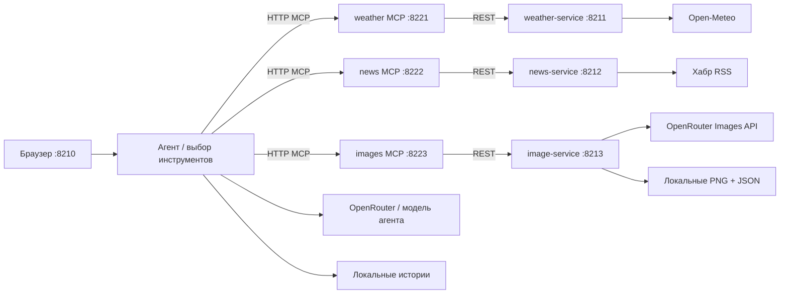

# День 20 — Атлас дня

Браузерный чат с агентом, который выбирает инструменты **трёх независимых HTTP MCP-серверов**:
погода, публикации Хабра и генерация изображений через OpenRouter.

Можно спросить погоду, получить десять публикаций со ссылками, попросить саммари, нарисовать
картинку по описанию или создать «картинку сегодняшнего дня» из реальной погоды и новостей.
Под ответом видны сервер, инструмент, параметры, результат, время и ошибки каждого вызова.

## Запуск локально

Нужны JDK 21+ (Gradle собирает с toolchain 21), Python 3.10+ и ключ OpenRouter.

```bash
cd day20
cp .env.example .env   # только при первом запуске, если .env ещё нет
# Заполнить OPENROUTER_API_KEY в .env
./run.sh
```

- **Чат:** http://localhost:8210
- **Swagger генерации изображений:** http://localhost:8213/swagger
- Swagger погоды: http://localhost:8211/swagger
- Swagger Хабра: http://localhost:8212/swagger

`run.sh` собирает проект, запускает семь отдельных JVM, дожидается готовности каждого процесса
и остаётся в терминале. **Ctrl+C останавливает все семь процессов.** Следующий запуск без сборки:
`./run.sh --no-build`. Если порт занят, запуск останавливается с понятной ошибкой.

Логи — `data/logs/`, переписки — `data/chats/`, изображения и их описания — `data/images/`.
Всё это и `.env` исключено из Git. Перезагрузка страницы восстанавливает текущий чат; новый
разговор создаёт отдельную историю. После перезапуска приложения сохранённые ответы и картинки
доступны, незавершённая генерация автоматически не повторяется.

Приложение слушает только `127.0.0.1`. Браузер общается с агентом, ключи внешних API находятся
на серверной стороне. Сетевой доступ нужен сервисам для Open-Meteo, Хабра и OpenRouter.

## Примеры запросов

```text
Какая сегодня погода в Москве? Ответь кратко.
Покажи десять новых публикаций Хабра по теме Kotlin со ссылками.
Какие сегодня популярные новости про искусственный интеллект?
Теперь сделай краткое саммари в трёх пунктах.
Сделай сводку за сегодняшний день: погода и главные новости Хабра.
Нарисуй рыжего кота-космонавта на Луне в стиле акварели.
Создай картинку сегодняшнего дня: погода и новости, редакционный коллаж.
```

Город по умолчанию — Москва; его можно изменить в боковой панели или назвать в сообщении.
Агент видит историю и результаты предыдущих инструментов: «теперь кратко» может пересказать
уже полученные публикации. Для новой картинки дня промпт требует заново получить актуальные данные.

## Архитектура



| Модуль | Назначение |
|---|---|
| `common` | HTTP-клиент с лимитами и таймаутами, JSON-схемы инструментов, валидация, OpenAPI и локальный Swagger UI |
| `weather-service` | Геокодирование и текущая погода / прогноз на сегодня |
| `news-service` | RSS Хабра, фильтры дат и темы, отбор до десяти уникальных публикаций |
| `image-service` | Текст → OpenRouter → локальный PNG, метаданные генерации, REST и Swagger |
| `mcp-server` | Общий адаптер, запущенный **тремя отдельными процессами** с аргументами `weather`, `news`, `images` |
| `agent` | Подключение MCP, цикл модели, история, фоновые запросы, события выполнения и веб-интерфейс |

Стек: Kotlin, Ktor, официальный Kotlin MCP SDK, kotlinx.serialization, Java HttpClient.
Сервисы не знают о MCP. Один код адаптера обслуживает три процесса, у каждого свой каталог
инструментов и свой REST-сервис. Транспорт — **stateless Streamable HTTP**, endpoint `/mcp`.

### Как агент выбирает сервер

При обработке сообщения агент подключается к каждому MCP-серверу и получает `tools/list`.
Каталог модели собирается из реальных MCP-описаний. К именам добавляется пространство имён:

| Имя для модели | Сервер | Локальное имя | REST |
|---|---|---|---|
| `weather__search_city` | `:8221/mcp` | `search_city` | `GET :8211/api/cities?query=Москва` |
| `weather__today` | `:8221/mcp` | `today` | `GET :8211/api/weather/today?latitude=55.75&longitude=37.62` |
| `news__headlines` | `:8222/mcp` | `headlines` | `GET :8212/api/news` |
| `images__generate` | `:8223/mcp` | `generate` | `POST :8213/api/images` |

Таблица маршрутизации связывает полное имя с конкретным MCP-клиентом и исходным именем.
Так одинаковые имена инструментов на разных серверах не конфликтуют. Схемы аргументов
передаются модели, затем проверяются при фактическом MCP-вызове.

Модель сама выбирает инструменты и последовательность; в коде нет диспетчера по ключевым словам
«погода», «новости» или «картинка». Цикл продолжается до текстового ответа: не более 12 обращений
к модели и 20 инструментов. Результат возвращается модели с исходным `tool_call_id`.

Ожидаемый длинный сценарий:

```text
weather__search_city → координаты города
weather__today       → погода, дата, часовой пояс
news__headlines      → todayOnly=true, timezone города, до десяти публикаций
images__generate    → описание с погодой и конкретными темами новостей
ответ + изображение в чате
```

Порядок определяется моделью и системным промптом; это не жёстко зашитый конвейер.
Трасса позволяет проверить фактический порядок и содержание аргументов. Для обычной картинки
нужен только сервер изображений, для сводки — погода и Хабр. Сбой подключения к одному серверу
не удаляет инструменты двух других.

### Что именно означает «новые и популярные»

- `mode=new`: без темы объединяются свежие ленты статей и новостей; с темой используется
  RSS-поиск Хабра `order_by=date`. Итог отсортирован по времени публикации.
- `mode=popular`: суточные топы статей и новостей чередуются с сохранением порядка внутри
  каждого раздела. Публикации старше 24 часов исключаются. При заданной теме все её слова
  должны присутствовать в заголовке, тегах или доступном анонсе.
- `mode=mixed` (по умолчанию): чередование популярных и новых с удалением дублей по ID.
- `todayOnly=true`: дополнительно остаются только публикации за текущую календарную дату
  в указанном `timezone`. Это отличается от скользящих последних 24 часов.
- `limit` — от 1 до 10, по умолчанию 10. Если подходящих материалов меньше, возвращается
  фактическое количество. Вчерашние статьи и посторонние темы не добавляются ради десятки.

Это **технологическая повестка Хабра**, включая статьи и новости. RSS — ограниченная выдача,
а не полный архив; тема в популярных фильтруется по доступному тексту, без семантических синонимов.
Подборка не претендует на единый рейтинг всего Хабра. В ответе API есть `selectionNote`,
`sources`, `publishedAt` и предупреждения о частично недоступных лентах.

Хабр игнорирует проверенный параметр `date=day` в RSS-поиске по рейтингу, поэтому такая
выдача не используется для суточного топа. Даты всегда проверяет сам сервис.
Анонс (`excerpt`) содержит начало статьи; саммари строится по этим данным, без заявления
о прочтении полного текста. Официальное описание лент: [Хабр — ленты и RSS](https://habr.com/ru/docs/help/lenta/).

### Погода сегодня

Геокодирование возвращает до пяти городов. По координатам Open-Meteo определяет часовой пояс;
ответ содержит текущие модельные данные и прогноз на весь сегодняшний день. Температура — °C,
ветер — м/с. Прогноз включает ещё не наступившие часы, это не архив наблюдений за полные сутки.
Источник: [Open-Meteo Forecast API](https://open-meteo.com/en/docs).

### Генерация изображений и Swagger

По умолчанию `bytedance-seed/seedream-4.5`, одна картинка, формат кадра `16:9`.
Модель меняется через `IMAGE_MODEL`; она должна поддерживать OpenRouter Images API и растровый
вывод. Сервис использует `POST /api/v1/images` с `model`, `prompt`, `aspect_ratio`, `n=1`.
Формат проверен по [документации OpenRouter](https://openrouter.ai/docs/guides/overview/multimodal/image-generation)
и каталогу параметров модели.

В Swagger откройте `POST /api/images` → **Try it out**:

```json
{
  "prompt": "Акварельная иллюстрация: рыжий кот-космонавт на поверхности Луны, Земля на фоне",
  "aspectRatio": "16:9"
}
```

```bash
curl http://localhost:8213/api/images \
  -H 'Content-Type: application/json' \
  -d '{"prompt":"Рыжий кот-космонавт на Луне, акварель","aspectRatio":"1:1"}'
```

Ответ: `id`, `url`, `prompt`, `model`, `aspectRatio`, `createdAt`, `width`, `height`, `usage`.
Относительный `url` можно открыть на порту сервиса `8213` или чата `8210`:
`/api/images/{id}/file`. Ответ модели сохраняется и нормализуется в PNG; SVG и HTML не выдаются.
Изображение появляется в чате непосредственно из результата инструмента — текстовая модель
не должна копировать base64 или придумывать ссылку.

Генерация может занимать несколько минут. На один пользовательский ход допускается
**одна попытка** генерации, включая неудачную; автоматические платные повторы заблокированы.
Настоящая генерация и обращения к модели агента расходуют баланс OpenRouter.

## Настройка

`.env` загружается скриптом запуска; явно заданные переменные окружения имеют приоритет.

| Переменная | Значение по умолчанию |
|---|---|
| `OPENROUTER_API_KEY` | Обязательный ключ для изображений и, по умолчанию, агента |
| `AGENT_MODEL` | `openai/gpt-4.1-mini` |
| `IMAGE_MODEL` | `bytedance-seed/seedream-4.5` |
| `DEFAULT_CITY` | `Москва` |
| `DEFAULT_TIMEZONE` | `Europe/Moscow` — время агента и новостей без города |
| `AGENT_BASE_URL` | `https://openrouter.ai/api/v1` |
| `AGENT_API_KEY` | Значение `OPENROUTER_API_KEY` |
| `OPENROUTER_BASE_URL` | `https://openrouter.ai/api/v1` — сервис изображений |
| `DATA_DIR` | `data` относительно `day20` |
| `CHAT_PORT` | `8210` |
| `WEATHER_PORT`, `NEWS_PORT`, `IMAGE_PORT` | `8211`, `8212`, `8213` |
| `WEATHER_MCP_PORT`, `NEWS_MCP_PORT`, `IMAGE_MCP_PORT` | `8221`, `8222`, `8223` |

Для отдельных адресов есть `WEATHER_API_URL`, `NEWS_API_URL`, `IMAGE_API_URL`,
`WEATHER_MCP_URL`, `NEWS_MCP_URL`, `IMAGE_MCP_URL`. По умолчанию они строятся из портов.
`GEOCODING_URL`, `FORECAST_URL`, `HABR_BASE_URL` позволяют подставить тестовые провайдеры.

Можно использовать DeepSeek для агента, оставив OpenRouter для картинок:

```dotenv
AGENT_BASE_URL=https://api.deepseek.com
AGENT_API_KEY=ваш_ключ_DeepSeek
AGENT_MODEL=deepseek-chat
```

Для ручного запуска отдельных процессов сначала экспортируйте значения `.env` в окружение,
затем используйте `./gradlew :weather-service:run`, `:news-service:run`, `:image-service:run`,
`:agent:run`; для MCP — `./gradlew :mcp-server:run --args=weather` (или `news`, `images`).

## Проверки

```bash
./gradlew installDist
python3 scripts/smoke.py
```

Интеграционная проверка запускает все семь настоящих процессов на временных портах.
Внешние API и ответы LLM заменены локальным HTTP-сервером с фиксированными сценариями;
MCP-клиент, транспорт, каталог инструментов, маршрутизация и REST-сервисы остаются настоящими.
Проверяются:

- погода → только weather; новости → только news; обычная картинка → только images;
- сводка → weather + news; картинка дня → weather + news + images в нужном порядке;
- наличие погоды и новостей перед составлением описания картинки;
- сохранение источников между сообщениями, выдача картинки через сервис и чат;
- даты публикаций, пустая выдача за сегодня, лимиты, удаление дублей;
- неизвестный инструмент, неправильные аргументы, отказ внешнего API;
- блокировка повторного платного вызова и одновременных сообщений в одном чате;
- OpenAPI, Swagger UI и локальные статические ресурсы.

Эти тесты проверяют механику на заданных ответах модели. Самостоятельный выбор инструментов
настоящей LLM дополнительно проверяется живыми запросами и виден в трассе чата.
Тексты публикаций считаются недоверенными данными; RSS разбирается с отключёнными внешними
XML-сущностями. Размеры ответов и время обращений ограничены.
