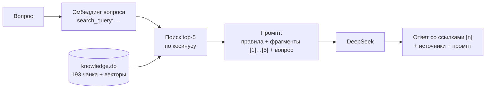

# День 22 — Первый RAG-запрос

Агент с двумя режимами. **С RAG:** вопрос → поиск похожих чанков в локальной базе знаний → чанки вместе с вопросом
в промпт → DeepSeek. **Без RAG:** тот же вопрос сразу в DeepSeek, с теми же параметрами. Режим выбирается
галочкой в браузере. Под ответом с RAG видно, какие фрагменты нашлись, насколько они похожи на вопрос
и какой промпт ушёл в модель. Раздел **«Внутри агента»** показывает весь путь одного запроса по шагам — с векторами,
рейтингом чанков и настоящими HTTP-запросами к Ollama и DeepSeek.

## Запуск

Нужны JDK 21+, Ollama с моделью эмбеддингов и ключ DeepSeek:

```bash
brew install ollama
brew services start ollama
ollama pull nomic-embed-text

cd day22
cp .env.example .env              # вписать DEEPSEEK_API_KEY
mkdir -p data/corpus              # положить сюда документы .md
./gradlew :rag-agent:bootRun
```

Откройте http://localhost:8240, раздел «Внутри агента» — http://localhost:8240/inside.html.
Сервис слушает только `127.0.0.1`. Ключ DeepSeek остаётся на сервере,
в браузер не уходит.

При первом запуске база знаний собирается сама. Документы из `data/corpus/` режутся на чанки, эмбеддинги
считаются в Ollama, результат ложится в `data/index/knowledge.db`. На 14 документах (≈84 тыс. символов) это
193 чанка и 7,5 с. Дальше база поднимается из файла за доли секунды. Корпус, база и контрольные вопросы
лежат в `data/` и в репозиторий не входят.

| Переменная           | По умолчанию               |
|----------------------|----------------------------|
| `DEEPSEEK_API_KEY`   | — (из `.env`)              |
| `DEEPSEEK_MODEL`     | `deepseek-chat`            |
| `OLLAMA_BASE_URL`    | `http://localhost:11434`   |
| `OLLAMA_EMBED_MODEL` | `nomic-embed-text`         |
| `PORT`               | `8240`                     |

Размер чанка, перекрытие и top-K задаются в `application.yml` (`knowledge.*`, `retrieval.top-k`).

## Как проходит запрос с RAG



Промпт без RAG — общие правила и вопрос. С RAG к тем же правилам добавляется: «отвечай только по
фрагментам, после утверждения ставь номер фрагмента, а если ответа во фрагментах нет — так и скажи».
Фрагменты идут в сообщение пользователя перед вопросом, под теми же номерами, что и источники под ответом.

Каждый вопрос отвечается отдельно, без истории диалога: иначе ответ зависел бы от прошлых реплик, и режимы
было бы не сравнить.

## Внутри агента

Страница `inside.html` разбирает один запрос на шесть шагов. Каждый ответ в чате ведёт сюда ссылкой
«Как агент пришёл к этому ответу». Там же можно выбрать любой запрос из журнала или задать новый.

| Шаг | Кубик | Что видно |
|---|---|---|
| 01 Вопрос | `Agent` | текст и режим |
| 02 Эмбеддинг | `EmbeddingClient` → Ollama | текст с префиксом `search_query:`, вектор из 768 чисел полосой (цвет — знак и величина), токены, тело запроса и ответа Ollama |
| 03 Поиск | `KnowledgeBase.rank` | косинус каждого из 193 чанков гистограммой с порогом top-5; первые 10 мест рейтинга — пять ушедших в промпт и пять, что «почти попали», с текстом чанка |
| 04 Промпт | `Prompts` | из чего сложен промпт — правила, фрагменты, вопрос — в символах и долях; сами сообщения system и user |
| 05 Модель | `LlmClient` → DeepSeek | HTTP-запрос как он ушёл (ключ скрыт) и ответ как он пришёл: модель, токены, `finish_reason`, время |
| 06 Ответ | `Agent` | ответ с подсвеченными ссылками [n] на фрагменты шага 3 |

Над шагами — строка конвейера со временем каждого шага и полоса «на что ушло время». В режиме без RAG шаги 2–3
помечены как пропущенные. Если запрос упал, видно, на каком шаге и с каким ответом провайдера, а дальше —
«не выполнялся».

Трассировку собирает сам агент. Клиенты Ollama и DeepSeek сами сериализуют JSON и отдают `HttpExchange` — ровно те байты,
что ушли и пришли, поэтому показанный запрос не реконструкция. Журнал `TraceJournal` живёт в памяти: после
перезапуска он пуст, как и лента чата в браузере.

## Устройство

```
advent/rag/
├── llm/            кубик «сообщения → ответ»: DeepSeek, OpenAI-совместимый /chat/completions
├── embedding/      кубик «текст → вектор»: Ollama /api/embed, префиксы search_document / search_query
├── chunking/       кубик «документ → чанки»: Document (шапка YAML) и FixedSizeChunker из day21
├── knowledge/      база знаний
│   ├── Indexer.kt        корпус → чанки → векторы → SQLite; при старте поднимает или собирает базу
│   ├── KnowledgeBase.kt  чанки в памяти, поиск top-K полным перебором по косинусу
│   └── SqliteStore.kt    файл базы: схема fixed-size.db из day21
├── retrieval/      Retriever — клиент RAG для агента: вопрос → вектор → top-K чанков
├── agent/          Agent.ask(question, useRag), Prompts, ответы PlainAnswer / RagAnswer
├── trace/          трассировка запроса: шаги EmbeddingStep / SearchStep / PromptStep / LlmStep и журнал в памяти
├── http/           HttpExchange — один обмен с внешним сервисом, как он был
├── eval/           прогон контрольных вопросов в обоих режимах и отчёт
└── web/            REST, ошибки и страницы — чат и «Внутри агента» (Vue 3 по CDN, Halo Light)
```

Агент знает `LlmClient` и `Retriever` и записывает шаги в трассировку. Про SQLite и префиксы модели он не знает.
Префиксы задачи ставит сам клиент эмбеддингов: чанки и вопросы `nomic-embed-text` кодирует по-разному.

## API

```bash
curl -s localhost:8240/api/ask -H 'Content-Type: application/json' \
  -d '{"question": "…", "rag": true}'
curl -s localhost:8240/api/knowledge                 # модель, нарезка, число документов и чанков
curl -s -X POST localhost:8240/api/knowledge/rebuild # пересобрать базу из data/corpus
curl -s -X POST localhost:8240/api/eval              # прогон контрольных вопросов
curl -s localhost:8240/api/traces                    # журнал запросов, новые первыми
curl -s localhost:8240/api/traces/<traceId>          # все шаги одного запроса
```

Ответ `/api/ask`: `mode` (`plain` или `rag`), `answer`, `prompt` — сообщения, ушедшие в модель, и `llm` — модель,
токены и время, `traceId` — по нему открывается трассировка. У ответа с RAG ещё `sources` (номер, документ,
косинус, текст чанка) и `retrievalMs`.

Ошибки приходят телом `{"message": …}`:
- 400 — пустой вопрос или неверное тело;
- 404 — запроса нет в журнале трассировок;
- 503 — база знаний не собрана;
- 502 — Ollama или DeepSeek не ответили. Ответ провайдера передаётся как есть.

## Контрольные вопросы

`data/eval/questions.json` — 10 вопросов по базе. У каждого указано, что должно быть в ответе и из каких
документов это берётся:

```json
{
  "id": 1,
  "question": "…",
  "expectation": "что должно быть в ответе",
  "sources": ["data/corpus/intro.md"]
}
```

Пустой `sources` — вопрос вне базы: с RAG агент должен честно сказать, что ответа нет. `POST /api/eval` задаёт
каждый вопрос в обоих режимах, проверяет, есть ли ожидаемые документы среди найденных фрагментов, и пишет
`data/eval/report.md`: найденные фрагменты с косинусом и оба ответа рядом. Верен ли ответ, человек решает
по ожиданию. 20 запросов к модели занимают около 25 с.

Типы вопросов:
- числа и факты, которые есть в базе;
- понятия, которые модель знает и без базы;
- практические правила из базы;
- расчёт по формуле;
- узкий термин, которого модель не знает;
- один вопрос вне базы.

## Сравнение качества

Ручная оценка 10 ответов каждого режима. Параметры: `deepseek-chat`, `nomic-embed-text`, чанки 500/50 символов, top-5.

| | Без RAG | С RAG |
|---|---|---|
| Верно | 8 | 3 |
| Частично | 1 | 2 |
| Не ответил («в базе нет ответа») | 0 | 5 |
| Выдумал или ошибся | 1 | —, но 2 неточности внутри ответов |
| Токенов промпта, в среднем | 86 | 1055 |
| Время ответа модели, в среднем | 1,4 с | 1,0 с + 71 мс на поиск |

Три метрики из лекции:

- **Context relevance — нашли ли нужные чанки.** Документ из ожидаемых источников оказался среди top-5 в 8 из 9
  вопросов, у которых ответ есть в базе. Но сам чанк с ответом был в top-5 только в 3 из 9. Проверка «по документу»
  сильно завышает качество поиска.
- **Faithfulness — основан ли ответ на контексте.** С RAG модель почти не выдумывает: когда нужного фрагмента нет,
  она так и говорит. Две неточности — следствие резки: модель додумала смысл таблицы без шапки и выдала похожий
  список за ответ на соседний вопрос.
- **Answer correctness — верен ли ответ.** 3 из 10 с RAG против 8 из 10 без него.

## Что выяснилось

- **Узкое место — поиск, а не генерация.** Когда чанк с ответом попадает в top-5, ответ с RAG точный и со
  ссылками на фрагменты. Когда не попадает, модель честно отказывается. Без RAG DeepSeek неплохо знает общую
  тему, поэтому на общих вопросах выигрывает.
- **Где RAG всё-таки лучше.**
  - Узкий термин из базы модель без RAG уверенно выдумала, а с RAG — отказалась.
  - Подробность, которая есть только в базе, знает только режим с RAG.
  - На вопрос вне базы RAG честно отвечает «нет ответа».
- **Фиксированный размер режет смысл.** В трёх вопросах граница чанка прошла посреди таблицы, списка или
  определения. Кусок с ответом нашёлся, но без продолжения. Перекрытия в 50 символов на это не хватает.
- **`nomic-embed-text` слабо понимает русский.** Для одного вопроса чанк с ответом
  оказался на 111-м месте из 193, для другого — на 55-м. В top-5 при этом попали вводные документы
  с косинусом 0,79–0,80. Разброс вообще маленький: у top-5 во всех вопросах косинус от 0,69 до 0,85, и по нему
  не отличить подходящий фрагмент от случайного.
- **Строгий промпт превращает частичный контекст в отказ.** Если во фрагменте только половина определения,
  модель пишет «нет ответа», а не «вот что есть». Зато и не выдумывает.
- **Увеличить top-K мало.** По рангам чанков с ответом: при top-10 добавился бы один вопрос, при top-15 — ещё два.
  Промпт при этом вырос бы в 2–3 раза. Следующие шаги — структурная нарезка из day21, многоязычная
  модель эмбеддингов и реранкинг найденных чанков.
- **DeepSeek подменяет модель.** В запросе `"model": "deepseek-chat"`, а в ответе `"model": "deepseek-flash"`: старое
  имя стало псевдонимом новой модели. Видно только в сыром HTTP-ответе на странице «Внутри агента».
- **Контекст стоит токенов.** Пять фрагментов по 500 символов — это ~1000 токенов промпта против ~90 без RAG.
  По времени разницы нет: поиск с эмбеддингом вопроса занимает 50–150 мс.
