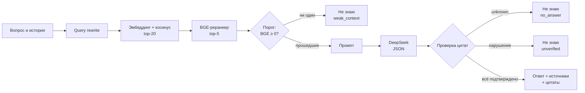

# День 24 — Цитаты, источники и «не знаю»

RAG-агент дня 23, доработанный так, что каждый ответ обязан вернуть:

- **ответ** со ссылками `[n]`;
- **источники** — только фрагменты, на которые ответ реально опирается: `source`, `section`, `chunkId`;
- **цитаты** — дословные куски этих фрагментов с позициями в тексте.

Если контекст слабый или ответ не подтверждается цитатами, агент говорит «Не знаю. Уточните вопрос.»

## Запуск

Нужны JDK 21, Ollama с `nomic-embed-text`, ключ DeepSeek и сервер реранкера на порту 8012 — как в дне 23:

```bash
brew install llama.cpp
mkdir -p data/models
curl -fL --retry 3 https://huggingface.co/gpustack/bge-reranker-v2-m3-GGUF/resolve/main/bge-reranker-v2-m3-FP16.gguf -o data/models/bge-reranker-v2-m3-FP16.gguf
llama-server -m data/models/bge-reranker-v2-m3-FP16.gguf --embedding --rerank --pooling rank -c 2048 -b 2048 -ub 2048 --host 127.0.0.1 --port 8012
```

В другом терминале:

```bash
cd day24
cp .env.example .env              # вписать DEEPSEEK_API_KEY
mkdir -p data/corpus              # документы .md с необязательными title и url в YAML
./gradlew :rag-agent:bootRun
```

Чат: http://localhost:8250. Трассировки: http://localhost:8250/inside.html.
Корпус, индекс, `.env` и результаты прогонов лежат в `data/` и в репозиторий не входят.

## Как проходит запрос



Режимы «Авто» и «Без RAG» убраны: ответ без источников противоречит заданию. Реранкер стал обязательным:
порог считается по его оценке. Переписывание поискового запроса работает всегда (`QUERY_REWRITE_ENABLED`),
без него не работают уточнения вроде «А когда он не нужен?».

## Порог релевантности

Фрагменты top-5 с оценкой BGE ниже `retrieval.min-rerank-score` (по умолчанию `0.0`) в промпт не идут.
Номера `[n]` при этом не сдвигаются: рейтинг отсортирован по оценке, прошедшие — его начало.
Если не прошёл ни один, модель не вызывается вообще — ответу не на что опереться.

Порог выбран по лучшей оценке BGE в прогоне дня 23 на тех же вопросах:

| | Лучшая оценка BGE | Косинус top-5 |
|---|---:|---:|
| Ответ в найденных фрагментах есть (8 вопросов) | от +1,80 до +6,50 | 0,64–0,83 |
| Поиск промахнулся (1 вопрос) | −6,36 | 0,72–0,77 |
| Вопрос вне корпуса (1 вопрос) | −7,47 | 0,69–0,73 |

Между группами по BGE зазор около 8 единиц, порог 0 лежит посередине. По косинусу порог не поставить:
диапазоны перекрываются. Оценка BGE — сырой логит, не вероятность.

## Контракт ответа

Модель вызывается в JSON-режиме и возвращает одно из двух:

```json
{"status": "answer", "answer": "текст со ссылками [1]", "quotes": [{"fragment": 1, "quote": "дословная выдержка"}]}
{"status": "unknown"}
```

`GroundingChecker` принимает ответ, только если:

- JSON разобран, а генерация не обрезана лимитом;
- есть хотя бы одна цитата, и номер каждой — среди фрагментов текущего промпта;
- каждая цитата **дословно** находится в своём фрагменте;
- у каждой ссылки `[n]` в тексте есть цитата из фрагмента `n`.

Любое нарушение — сразу «не знаю» со статусом `unverified`, повторного запроса нет. `QuoteLocator` прощает
только оформление: пробелы, регистр, ё/е, вид кавычек и тире, Markdown-символы `*`, `` ` ``, `|`, `#`. Пересказ,
многоточие внутри цитаты и склейка кусков не проходят. В ответ API и в чат уходит текст источника
по найденным offsets (UTF-16, в `content` чанка), а не версия модели.

Ответ `POST /api/ask`:

| Поле | Что внутри |
|---|---|
| `status` | `answered` или один из видов «не знаю»: `weak_context`, `no_answer`, `unverified` |
| `answer` | Текст со ссылками `[n]` или «Не знаю. Уточните вопрос.» |
| `reason` | Почему такой статус: какие фрагменты подтвердили ответ, какая оценка не прошла порог, какие цитаты не нашлись |
| `sources[]` | `number`, `chunkId`, `source`, `section`, `title`, `url`, косинус `score`, `rerankScore`, `text` |
| `quotes[]` | `number`, `chunkId`, `text`, `start`, `end` |
| `relevance` | Порог, лучшая оценка, сколько фрагментов прошло из top-K |
| `prompt`, `llm` | Пусты, если модель не вызывалась |

В чате цитаты показаны отдельным блоком и подсвечены внутри своего фрагмента. Ссылка `[n]` раскрывает
источник. «Внутри агента» добавились шаги «Порог релевантности» и «Проверка цитат»: что написала модель,
нашлась ли каждая цитата, какие нарушения.

## Настройки и API

`DEEPSEEK_API_KEY`, `DEEPSEEK_MODEL`, `DEEPSEEK_BASE_URL`, `OLLAMA_BASE_URL`, `OLLAMA_EMBED_MODEL`, `PORT` (8250),
`RERANKER_BASE_URL`, `RERANKER_TIMEOUT`, `RETRIEVAL_CANDIDATE_K` (20), `RETRIEVAL_TOP_K` (5),
`RETRIEVAL_MIN_RERANK_SCORE` (0.0), `QUERY_REWRITE_ENABLED` (true).

```bash
curl localhost:8250/api/ask -H 'Content-Type: application/json' -d '{"question":"Ваш вопрос по корпусу","history":[]}'
curl localhost:8250/api/ask -H 'Content-Type: application/json' -d '{"question":"Как приготовить борщ?"}'
curl localhost:8250/api/knowledge/status
curl localhost:8250/api/traces
```

История — список `{role: "user" | "assistant", content}`, не больше 12 сообщений и 30 000 символов.

## Проверка на 10 вопросах

```bash
python3 tools/eval_citations.py
```

Скрипт берёт 10 контрольных вопросов из `data/eval/questions.json` и добавляет ещё три: уточнение с историей
и два заведомо слабых контекста (посторонний вопрос и «Расскажи про него подробнее» без истории).
Для каждого ответа `answered` он **независимо от сервера** проверяет: есть источники, есть цитаты, каждая
цитата — ровно тот кусок проиндексированного чанка, на который указывают её offsets, каждая `[n]`
подкреплена цитатой, источники совпадают с фрагментами цитат. Результат — `data/eval/citations-run.json`.

| | Результат |
|---|---|
| Ответ с источниками и цитатами | 8 из 10 контрольных + уточнение |
| Все автоматические проверки цитат | 9/9 ответов |
| «Не знаю» на вопросе вне корпуса и двух слабых контекстах | 3/3, модель не вызывалась |
| Смысл ответа совпадает с цитатами (ручная сверка) | 9/9: каждое утверждение есть в процитированном фрагменте |
| Цитаты покрывают каждое утверждение | 7/9 |

Ручная сверка: выдумок не найдено. В двух ответах ссылка `[n]` стоит у утверждения, которое есть во фрагменте,
но приложенная цитата покрывает только часть фрагмента. Например, «четыре уровня» подкреплены цитатой
с первым из них. Проверка требует цитату на каждую ссылку, а не на каждое утверждение. Смысловое соответствие
автоматически не проверяется.

Вопрос 3 честно получил «не знаю»: ответ в корпусе есть, но поиск его не находит (лучшая оценка BGE −6,36).
Это прежний промах поиска из дней 22–23. Раньше модель на нём отвечала «ответа нет» и одновременно ссылалась
на все пять фрагментов. Переформулировка с перцентилями и словом latency проходит порог (+1,20)
и получает ответ с цитатами — так и работает просьба уточнить вопрос.

Отдельно проверены оставшиеся пути «не знаю». Если фрагмент прошёл порог, но ответа в нём нет, модель
возвращает `unknown` (`no_answer`). Неверная цитата, `[n]` без цитаты, ответ без цитат, номер вне контекста,
битый или обрезанный JSON дают `unverified`.

## Тесты

```bash
./gradlew :rag-agent:test :rag-agent:bootJar
```

Тесты дня 23 сохранены и обновлены: структурная нарезка, SQLite, протокол реранкера, порог и нумерация
фрагментов после реранкинга, переписывание запроса.
