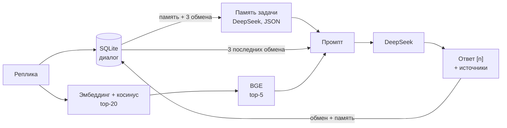

# День 25 — Мини-чат с RAG, историей и памятью задачи

Веб-чат на основе RAG-агента дня 23:

- **хранит историю диалогов** в SQLite: список диалогов, переживает перезагрузку страницы и перезапуск сервера;
- **на каждую реплику ищет контекст** в базе знаний: эмбеддинг → top-20 по косинусу → BGE-реранкер → top-5;
- **отвечает по найденным фрагментам** со ссылками `[n]`;
- **всегда выводит источники** — пять фрагментов, переданных модели, с отметкой, на какие сослался ответ;
- **ведёт память задачи**: цель диалога, что пользователь уточнил, ограничения и зафиксированные термины.

## Запуск

Нужны JDK 21, Ollama с `nomic-embed-text`, ключ DeepSeek и сервер реранкера на порту 8012 — как в дне 23:

```bash
brew install llama.cpp
mkdir -p data/models
curl -fL --retry 3 https://huggingface.co/gpustack/bge-reranker-v2-m3-GGUF/resolve/main/bge-reranker-v2-m3-FP16.gguf -o data/models/bge-reranker-v2-m3-FP16.gguf
llama-server -m data/models/bge-reranker-v2-m3-FP16.gguf --embedding --rerank --pooling rank -c 2048 -b 2048 -ub 2048 --host 127.0.0.1 --port 8012
```

В другом терминале:

```bash
cd day25
cp .env.example .env              # вписать DEEPSEEK_API_KEY
mkdir -p data/corpus              # документы .md с необязательными title и url в YAML
./gradlew :rag-agent:bootRun
```

Чат: http://localhost:8260. Трассировки: http://localhost:8260/inside.html.
Корпус, индекс, диалоги, `.env` и результаты прогонов лежат в `data/` и в репозиторий не входят.

## Как проходит реплика



1. `ChatStore` достаёт диалог: память задачи и все обмены.
2. `TaskMemory` отдельным вызовом DeepSeek (JSON, temperature 0) обновляет память по новой реплике.
3. `Retriever` ищет по тексту реплики как есть и переранжирует кандидатов BGE.
4. `PromptBuilder` собирает промпт: правила, блок памяти, последние 3 обмена, фрагменты и реплику.
5. Ответ, источники и снимок памяти сохраняются одной транзакцией как новый обмен.

## Память задачи

```json
{"goal": "чего пользователь хочет добиться в итоге", "clarified": ["факты о его ситуации"],
 "constraints": ["ограничения и требования"], "terms": ["термин — как понимаем в этом диалоге"]}
```

- Модель получает прежнюю память, окно истории и новую реплику и возвращает память **целиком**. Так корректно
  обрабатываются замены: «не 300, а 1200 запросов в секунду» заменяет пункт, а не добавляет второй.
- В память идут только слова пользователя. Ответы ассистента и фрагменты базы знаний фактами для неё не считаются.
- Разницу между прежней и новой памятью считает код (`MemoryChange`): если модель молча выбросит пункт,
  он будет виден как удалённый — в чате под ответом и на шаге «Память задачи» в трассировке.
- Если JSON не разобран или обрезан, память не меняется, а под ответом появляется предупреждение.

**Почему окно истории маленькое.** В промпт ответа идут только последние 3 обмена (`CHAT_HISTORY_TURNS`). Диалог
на 15 сообщений целиком поместился бы в контекст модели, и проверка «не теряет цель» ничего бы не доказала.
С окном в 3 обмена цель, названная в первой реплике, уже к пятой видна модели только через память.

В блоке памяти промпта сказано: держать ответ в рамках цели, соблюдать ограничения и термины, использовать
факты пользователя без ссылок `[n]`, а общие правила подкреплять фрагментами со ссылками.

## Что убрано из дня 23

- Маршрутизатор режимов «Авто / RAG / Без RAG»: поиск выполняется на каждую реплику.
- Query rewrite: поисковый запрос — текст реплики. Цена этого решения — в разделе проверки.
- Переключатели реранкинга и rewrite. Реранкер обязателен; ветки top-5 по косинусу нет.
- История в браузере и `POST /api/ask`. Их заменили диалоги на сервере.

## Чат

Слева — список диалогов: заголовок по первой реплике и цель из памяти; диалог можно открыть или удалить.
Справа — панель «Память задачи», пункты, изменённые последним обменом, отмечены «новое». Под каждым ответом —
строка изменений памяти, ссылки `[n]` раскрывают свой фрагмент, ниже источники и промпт.
На узком экране панель памяти встаёт над лентой и сворачивается.

«Внутри агента» показывает путь одной реплики: память (было/стало, изменения, обмен с DeepSeek), эмбеддинг,
поиск, реранкинг, промпт с выделенным блоком памяти, вызов модели и ответ. Журнал трассировок живёт в памяти
сервиса (100 последних), диалоги — в SQLite.

## Настройки и API

`DEEPSEEK_API_KEY`, `DEEPSEEK_MODEL`, `DEEPSEEK_BASE_URL`, `OLLAMA_BASE_URL`, `OLLAMA_EMBED_MODEL`, `PORT` (8260),
`RERANKER_BASE_URL`, `RERANKER_TIMEOUT`, `RETRIEVAL_CANDIDATE_K` (20), `RETRIEVAL_TOP_K` (5),
`CHAT_HISTORY_TURNS` (3), `TASK_MEMORY_ENABLED` (true). Диалоги — `data/chat/chat.db`, отдельно от индекса:
пересборка индекса их не трогает.

```bash
curl localhost:8260/api/settings
curl -X POST localhost:8260/api/conversations                     # новый диалог → {"id": …}
curl localhost:8260/api/conversations/<id>/messages -H 'Content-Type: application/json' \
  -d '{"message":"Ваш вопрос по корпусу"}'
curl localhost:8260/api/conversations                             # список: id, title, goal, turns
curl localhost:8260/api/conversations/<id>                        # память и все обмены
curl -X DELETE localhost:8260/api/conversations/<id>
curl localhost:8260/api/traces
```

Ответ на сообщение — обмен `Turn`: `number`, `question`, `answer`, `sources[]` (`number`, `chunkId`, `source`,
`title`, `section`, `url`, косинус `score`, `rerankScore`, `used`, `text`), `memory` — память после обмена,
`memoryUpdate` (`status`: `updated / unchanged / fallback / disabled`, `changes[]`), `warnings`, `prompt`, `llm`,
`reranking`, `traceId`. Ошибки имеют вид `{"message":"..."}`.

## Проверка на длинных диалогах

```bash
python3 tools/eval_dialogs.py                                     # режим берётся из /api/settings
TASK_MEMORY_ENABLED=false ./gradlew :rag-agent:bootRun            # для контрольного прогона
```

Два сценария в `data/eval/dialogs.json`: список требований к своему сервису (15 сообщений) и черновик документа
об архитектурном решении (14 сообщений). В каждом есть цель в первой реплике, уточнения, отступление в сторону,
смена ограничения посередине и итоговая просьба «собери всё с учётом обсуждённого» — далеко за окном истории.
Скрипт проверяет у каждого ответа источники и допустимые `[n]` и ищет в итоговом ответе ключевые ранние факты.
Результаты — `data/eval/dialogs-run-memory.json` и `dialogs-run-nomemory.json`, ручная сверка — `dialogs-review.md`.

| | С памятью | Без памяти |
|---|---:|---:|
| Ответы с источниками и допустимой ссылкой `[n]` | 29/29 | 27/29 |
| Ранние факты в итоговом ответе, сценарий 1 | 5/5 | 1/5 |
| Ранние факты в итоговом ответе, сценарий 2 | 5/5 | 1/5 |
| Смен цели в памяти | 0 | — |

Найденные фрагменты в обоих прогонах совпадают по ходам: разница в ответах — только от памяти. Без неё на итоговую
просьбу модель отвечает, что для черновика «нужны детали самого решения», а список требований строит без цифр
пользователя. С памятью итог содержит все факты, включая заменённое посередине значение нагрузки.

Что показала ручная сверка:

- **Поиск без переформулировки слаб на уточнениях и итогах.** 14 из 29 реплик получили контекст с лучшей оценкой
  BGE ниже 0, итоговые «собери всё» — около −9. Ответ на них держится на памяти, а ссылки идут на общие фрагменты.
  На одной реплике без памяти модель ответила общими знаниями без ссылок; чат показал предупреждение.
- **Память не мешает досочинять.** В черновике документа модель добавила в решение пункты, которых пользователь
  не говорил. Ссылок к ним нет, но и пометки, что это предположение, тоже нет.
- **Промпты правились по первым прогонам.** Модель отказывалась строить итог из данных пользователя, когда фрагменты
  слабые; записывала в память пересказ ответа ассистента; клала один факт в два поля. Правки описаны в
  `dialogs-review.md`, таблица выше — после них.

## Тесты

```bash
./gradlew :rag-agent:test :rag-agent:bootJar
```

Тесты дня 23 сохранены и обновлены под обязательный реранкер: структурная нарезка, SQLite индекса, протокол
реранкера, нумерация фрагментов после реранкинга. Тесты query rewrite удалены вместе с ним.
