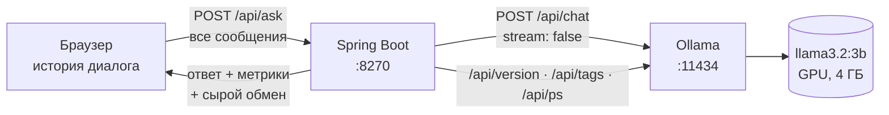

# День 26 — Локальная LLM

`llama3.2:3b` работает на этом компьютере в Ollama. Обращаться к ней можно тремя способами:

- **CLI** — `ollama run`;
- **HTTP API** Ollama — нативный `/api/*` и OpenAI-совместимый `/v1/*`;
- **веб-чат** на Spring Boot. Под каждым ответом он показывает скорость генерации и сырой HTTP-обмен с Ollama:
  что ушло в модель, что пришло обратно и тот же запрос в виде `curl`.

Облака и API-ключей нет: запросы не уходят дальше `localhost`.

## Запуск

```bash
brew install ollama            # или приложение с ollama.com; на Linux: curl -fsSL https://ollama.com/install.sh | sh
ollama serve                   # если Ollama не запущена как приложение
ollama pull llama3.2:3b        # 2 ГБ, квантование Q4_K_M

cd day26
./gradlew :local-chat:bootRun
```

Чат: http://localhost:8270. Нужен JDK 21.

Настройки — переменные окружения, по умолчанию:

| Переменная | Значение |
|---|---|
| `OLLAMA_CHAT_MODEL` | `llama3.2:3b` — любая модель из `ollama list` |
| `OLLAMA_TEMPERATURE` | `0.2` |
| `SYSTEM_PROMPT` | `Ты — полезный ассистент. Отвечай на русском языке.` Пустое значение — без системного сообщения |
| `OLLAMA_BASE_URL` | `http://localhost:11434` |
| `PORT` | `8270` |

## Как устроено



- **Модель ничего не помнит между вызовами.** История живёт в браузере и уходит в каждом запросе целиком,
  системный промпт сервер добавляет из конфигурации. В блоке «Что ушло в Ollama» видно, как массив `messages`
  растёт с каждой репликой.
- **Нативный `/api/chat`, а не `/v1/chat/completions`.** OpenAI-совместимый ответ содержит только токены, а
  нативный ещё и тайминги: загрузку модели, обработку промпта и генерацию. Из них считаются метрики под ответом.
- **`stream: false`.** Ответ приходит одним JSON, который удобно показать как есть. Как выглядит стриминг —
  в разделе с curl ниже.
- **Статус модели в сайдбаре** собирается из трёх GET-запросов. `/api/version` даёт версию Ollama, `/api/tags` —
  скачанные модели с размером и квантованием, `/api/ps` — что сейчас в памяти, сколько занимает, какая доля
  на GPU и когда выгрузится.
- **Ошибки Ollama выводятся дословно.** Пример: `Ollama ответила 404 на /api/chat: {"error":"model 'x' not found"}`.

### Холодный и тёплый старт

Ollama держит модель в памяти 5 минут после последнего запроса (`keep_alive`), потом выгружает её.
Первый запрос после выгрузки читает модель с диска, это видно в `load_duration`:

| Состояние | Загрузка модели |
|---|---|
| Модель выгружена | 1,0–1,3 с |
| Модель в памяти | 2–9 мс |

## Проверка

### Модель запускается локально

```
$ ollama list
NAME                       ID              SIZE      MODIFIED
llama3.2:3b                a80c4f17acd5    2.0 GB    …

$ ollama ps
NAME           ID              SIZE      PROCESSOR    CONTEXT    UNTIL
llama3.2:3b    a80c4f17acd5    4.3 GB    100% GPU     32768      4 minutes from now
```

На диске модель весит 2 ГБ, а в памяти занимает 4,3 ГБ: к весам добавляется KV-кэш на 32 768 токенов
контекста. Вся модель на GPU (Apple Metal).

### CLI

```
$ ollama run llama3.2:3b --verbose "Что такое HTTP? Ответь одним предложением."
HTTP (Hypertext Transfer Protocol) — это protocol, используемый для обмена данными между устройствами internet и веб-страницами.

total duration:       753.50525ms
load duration:        1.031375ms
prompt eval count:    36 token(s)
prompt eval duration: 75.311ms
prompt eval rate:     212.45 tokens/s
eval count:           34 token(s)
eval duration:        674.9ms
eval rate:            50.38 tokens/s
```

Без аргумента `ollama run llama3.2:3b` открывает интерактивный режим, выход — `/bye`.

### HTTP API

`curl http://localhost:11434` отвечает `Ollama is running`. Готовые запросы — в разделе [Поиграть через curl](#поиграть-через-curl).

## Три запроса разной сложности

Отправлены из чата, каждый в новом диалоге, `temperature 0.2`. Готовые запросы есть в сайдбаре.

| Уровень | Запрос | Токены: промпт → ответ | Генерация | Весь запрос | Итог |
|---|---|---|---|---|---|
| 🟢 Простой | «Что такое HTTP? Ответь одним предложением.» | 56 → 57 | 47,3 ток/с | 1,3 с | ✅ Верно |
| 🔵 Средний | Функция `isPalindrome` на Kotlin, игнорирующая регистр, пробелы и знаки, плюс два примера | 89 → 254 | 46,7 ток/с | 5,6 с | ⚠️ Код не компилируется |
| 🟠 Сложный | Два поезда навстречу: 9:40 и 10:10, 80 и 100 км/ч, 330 км. Во сколько встретятся? | 120 → 588 | 44,8 ток/с | 13,3 с | ❌ Неверно |

**Простой.** Определение верное и в одно предложение, как просили.

**Средний.** Код выглядит правдоподобно, но есть три ошибки:

- `s = s.toLowerCase()...` не скомпилируется: параметр функции в Kotlin — `val`;
- регулярное выражение `[^a-z0-9]` выбросит кириллицу, поэтому «А роза упала на лапу Азора» не пройдёт проверку;
- в пояснении строка «A man, a plan, a canal: Panama» сокращена до `amanaplanacanalpana` без последнего «ma».

**Сложный.** Модель считает, за сколько каждый поезд проехал бы все 330 км, складывает эти времена и делает
вывод: «оба поезда не встретятся». Верное решение:

1. К 10:10 первый поезд проехал 40 км.
2. Осталось 290 км при скорости сближения 180 км/ч, это 1 ч 36 мин 40 с.
3. Ответ: в 11:46:40.

Ещё один пример — загадка «У фермера 17 овец, все, кроме 9, убежали. Сколько осталось?». Модель отвечает
«8», хотя верно 9.

**Вывод.** Скорость почти не зависит от сложности: 45–48 токенов в секунду на любом запросе. Сложный запрос
дольше только потому, что ответ длиннее. Падает качество. Модель на 3 млрд параметров хорошо справляется
с фактами и короткими формулировками. В коде она ошибается в деталях, а многошаговое рассуждение уверенно
доводит до неверного ответа. В русских ответах местами проскакивают английские слова (`protocol`,
`internet`) и смешанные алфавиты (`Пaris`).

## Поиграть через curl

Все команды проверены на Ollama 0.34.4. Для разбора JSON нужен `jq` (`brew install jq`). Заголовок
`Content-Type` нативный API Ollama не требует.

### 0. Ollama жива? Какие модели скачаны и какие в памяти

```bash
curl -s http://localhost:11434/api/version
curl -s http://localhost:11434/api/tags | jq '.models[] | {name, size, details}'
curl -s http://localhost:11434/api/ps   | jq '.models[] | {name, size, size_vram, context_length, expires_at}'
```

### 1. Самый короткий запрос: один промпт без истории

```bash
curl -s http://localhost:11434/api/generate -d '{
  "model": "llama3.2:3b",
  "prompt": "Что такое HTTP? Ответь одним предложением.",
  "stream": false
}' | jq -r .response
```

### 2. Чат с системным промптом: ровно то, что отправляет приложение

```bash
curl -s http://localhost:11434/api/chat -d '{
  "model": "llama3.2:3b",
  "messages": [
    {"role": "system", "content": "Ты — полезный ассистент. Отвечай на русском языке."},
    {"role": "user", "content": "Что такое HTTP? Ответь одним предложением."}
  ],
  "stream": false,
  "options": {"temperature": 0.2}
}' | jq '{
  answer: .message.content,
  load_ms: (.load_duration / 1e6),
  prompt_tokens: .prompt_eval_count,
  answer_tokens: .eval_count,
  tokens_per_second: (.eval_count / .eval_duration * 1e9 | floor)
}'
```

Без `| jq …` виден сырой ответ целиком.

### 3. Стриминг: так Ollama отвечает по умолчанию

Без `"stream": false` приходит NDJSON: одна строка JSON на каждый кусочек текста, последняя с `"done": true`
и метриками.

```bash
curl -sN http://localhost:11434/api/chat -d '{
  "model": "llama3.2:3b",
  "messages": [{"role": "user", "content": "Перечисли через запятую три цвета радуги."}]
}'
```

Чтобы видеть только текст по мере генерации, добавьте `| jq -j '.message.content'`.

### 4. История: модель помнит только то, что пришло в запросе

```bash
curl -s http://localhost:11434/api/chat -d '{
  "model": "llama3.2:3b",
  "messages": [
    {"role": "user", "content": "Мой любимый язык программирования — Kotlin. Запомни."},
    {"role": "assistant", "content": "Запомнил: ваш любимый язык — Kotlin."},
    {"role": "user", "content": "Какой мой любимый язык программирования?"}
  ],
  "stream": false,
  "options": {"temperature": 0}
}' | jq -r .message.content
```

Модель ответит «Kotlin». Уберите первые два сообщения, и она скажет, что не знает.

### 5. Параметры генерации

```bash
curl -s http://localhost:11434/api/chat -d '{
  "model": "llama3.2:3b",
  "messages": [{"role": "user", "content": "Придумай название для кофейни."}],
  "stream": false,
  "options": {"temperature": 1.2, "seed": 42, "num_predict": 30}
}' | jq -r '"\(.message.content) [\(.done_reason)]"'
```

- **`seed`.** С одинаковым `seed` ответ повторяется даже при высокой температуре. Уберите его, и ответы начнут
  различаться.
- **`num_predict`.** Ограничивает длину ответа. Обрезанный ответ приходит с `done_reason: "length"`.
- **`num_ctx`.** Ещё одна полезная опция: размер контекста. Ollama 0.34 по умолчанию берёт 32 768 токенов.

### 6. Ответ строго по JSON-схеме

```bash
curl -s http://localhost:11434/api/chat -d '{
  "model": "llama3.2:3b",
  "messages": [{"role": "user", "content": "Опиши протокол HTTPS: название, порт по умолчанию и шифруется ли трафик."}],
  "stream": false,
  "format": {
    "type": "object",
    "properties": {
      "name": {"type": "string"},
      "default_port": {"type": "integer"},
      "encrypted": {"type": "boolean"}
    },
    "required": ["name", "default_port", "encrypted"]
  },
  "options": {"temperature": 0}
}' | jq '.message.content | fromjson'
```

Ответ: `{"name": "HTTPS", "default_port": 443, "encrypted": true}`.

### 7. OpenAI-совместимый API

К этому эндпоинту можно подключить любой клиент, написанный под OpenAI или DeepSeek. Например, `LlmClient`
дня 25, если сменить `base-url`.

```bash
curl -s http://localhost:11434/v1/chat/completions -H 'Content-Type: application/json' -d '{
  "model": "llama3.2:3b",
  "messages": [{"role": "user", "content": "Что такое HTTP? Ответь одним предложением."}]
}' | jq '{answer: .choices[0].message.content, usage}'
```

### 8. Через приложение дня 26

```bash
curl -s http://localhost:8270/api/status | jq
curl -s http://localhost:8270/api/ask -H 'Content-Type: application/json' -d '{
  "messages": [{"role": "user", "content": "Что такое HTTP? Ответь одним предложением."}]
}' | jq '{answer, metrics}'
```

В ответе `/api/ask` есть и поле `exchange`: сырой запрос к Ollama и её ответ, те же, что в блоке под сообщением в чате.

### 9. Холодный старт своими руками

```bash
curl -s http://localhost:11434/api/generate -d '{"model": "llama3.2:3b", "keep_alive": 0}'   # выгрузить из памяти
curl -s http://localhost:11434/api/ps | jq '.models | length'                                 # 0
curl -s http://localhost:11434/api/generate -d '{"model": "llama3.2:3b", "prompt": "Привет", "stream": false}' \
  | jq '{load_ms: (.load_duration / 1e6 | floor), response}'                                  # load_ms ≈ 1000
```

### Три запроса из таблицы

```bash
ask() {
  curl -s http://localhost:11434/api/chat -d "$(jq -n --arg q "$1" '{
    model: "llama3.2:3b", stream: false, options: {temperature: 0.2},
    messages: [{role: "system", content: "Ты — полезный ассистент. Отвечай на русском языке."}, {role: "user", content: $q}]
  }')" | jq -r '.message.content, "— \(.eval_count) ток., \(.eval_count / .eval_duration * 1e9 | floor) ток/с"'
}
ask 'Что такое HTTP? Ответь одним предложением.'
ask 'Напиши на Kotlin функцию isPalindrome(s: String): Boolean, которая игнорирует регистр, пробелы и знаки препинания. Добавь два примера вызова.'
ask 'Из города А в 9:40 выехал поезд со скоростью 80 км/ч. В 10:10 навстречу ему из города Б выехал второй поезд со скоростью 100 км/ч. Расстояние между городами 330 км. Во сколько поезда встретятся? Реши по шагам.'
```

## Метрики в ответе Ollama

Все длительности — в **наносекундах**: `"total_duration": 1279869750` — это 1,28 с.

| Поле | Что это |
|---|---|
| `total_duration` | Всё время обработки запроса в Ollama |
| `load_duration` | Загрузка модели в память; при тёплом старте единицы миллисекунд |
| `prompt_eval_count` / `prompt_eval_duration` | Токены промпта и время их обработки. Префикс прошлого запроса берётся из кэша: в повторном запросе он есть в `prompt_eval_cached_count` |
| `eval_count` / `eval_duration` | Сгенерированные токены и время генерации. Скорость: `eval_count / eval_duration × 10⁹` ток/с |
| `done_reason` | `stop` — модель закончила сама, `length` — упёрлась в `num_predict`, `unload` — запрос на выгрузку |

## Что сознательно не делали

- **Стриминг в чате.** Ответ одним JSON показывает сырой обмен без склейки сотен строк NDJSON. Стриминг можно
  посмотреть в curl-примере 3.
- **Хранение диалогов.** История живёт во вкладке браузера, при обновлении страницы диалог начинается заново.
- **Переключатель моделей в интерфейсе.** Модель задаётся через `OLLAMA_CHAT_MODEL` и перезапуск.
