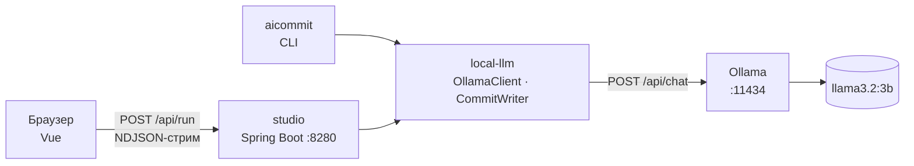
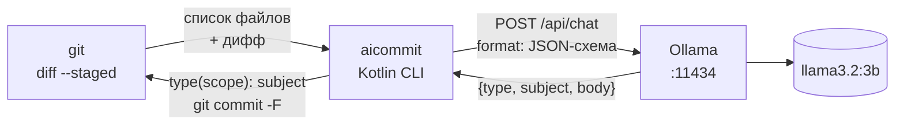

# День 27 — Локальная LLM в приложении

Два приложения на `llama3.2:3b`, которая работает в Ollama на этом же компьютере. Облака и API-ключей нет,
запросы не уходят дальше `localhost`.

- **Локальная мастерская** — веб-интерфейс: пишешь текст, получаешь результат. Четыре инструмента: перевод,
  конвертер форматов, редактура и сообщение коммита по `git diff`. Ответ появляется по мере генерации.
- **`aicommit`** — CLI для git: по staged-изменениям пишет сообщение коммита и коммитит.

Оба приложения используют общий модуль `local-llm`: в нём клиент Ollama и генерация сообщения коммита.



## Часть 1. Локальная мастерская

```bash
ollama pull llama3.2:3b        # 2 ГБ; Ollama должна быть запущена
cd day27
./gradlew :studio:bootRun
```

Открыть http://localhost:8280. Нужен JDK 21+.

| Переменная | По умолчанию |
|---|---|
| `OLLAMA_MODEL` | `llama3.2:3b` — любая модель из `ollama list` |
| `OLLAMA_BASE_URL` | `http://localhost:11434` |
| `PORT` | `8280` |

### Инструменты

| Вкладка | Что делает | Опции | Что проверяет код |
|---|---|---|---|
| 🌐 Перевод | Переводит, сохраняя тон и форматирование | Авто RU ⇄ EN, English, Русский, Deutsch, Español, Français | «Авто» выбирает направление по алфавиту текста: кириллица → EN, остальное → RU |
| 🔄 Форматы | Перекладывает данные: на входе JSON, YAML, CSV, XML или свободный текст | JSON, YAML, CSV, Markdown-таблица | Парсит результат: ✓ «JSON парсится · массив из 3 элементов» или ✗ с ошибкой парсера |
| ✍️ Редактура | Правит текст на том же языке | Исправить ошибки, Сократить, Официально, Проще | — |
| 📝 Коммит | Пишет Conventional Commit по вставленному `git diff` | — | Scope, ужатие диффа, сборка заголовка — как в `aicommit` |

У каждой вкладки есть готовые примеры: удобно для демонстрации. Вкладки помнят свой ввод и результат.
Под результатом видно, через сколько пришёл первый токен, сколько длился весь запрос, сколько было токенов
в запросе и ответе и с какой скоростью шла генерация. На холодном старте добавляется время загрузки модели
с диска. В блоке «Что ушло в Ollama» показано тело `POST /api/chat` вместе с системным промптом инструмента.
Генерацию можно остановить, тогда частичный текст остаётся на экране. Запуск — кнопкой или Ctrl/⌘+Enter.

### Как устроено

- **Стриминг.** Сервер вызывает `/api/chat` со `stream: true`, а Ollama отвечает NDJSON по токену в строке.
  Каждый кусок текста сразу уходит в браузер своим NDJSON-событием (`start` → `delta`… → `done` или `error`).
  Браузер читает их через `fetch` и `ReadableStream`. Первый токен приходит через 30–320 мс.
- **`ResponseBodyEmitter`, а не `StreamingResponseBody`.** Сначала стрим был на `StreamingResponseBody`,
  и весь ответ приходил одним куском в конце генерации. Ollama при этом стримила нормально: первая строка
  через 0,07 с, последняя через 2,1 с. Оказалось, Spring 7 отдаёт в `StreamingResponseBody`
  `StreamUtils.NonFlushingOutputStream`, и `flush()` там ничего не делает. С `ResponseBodyEmitter`
  первое событие приходит через 0,09 с.
- **Кнопка «Остановить»** обрывает `fetch`. На сервере падает отправка события, стрим строк из Ollama
  закрывается вместе с HTTP-запросом, и модель перестаёт генерировать.
- **Результат конвертера проверяет код.** Модель иногда заворачивает ответ в ` ```json `, хотя ей это
  запрещено, поэтому обёртку снимает код. JSON проверяется Jackson с `FAIL_ON_TRAILING_TOKENS`,
  YAML — SnakeYAML, CSV — одинаковым числом колонок, Markdown — разделителем `|---|` и числом ячеек.
- **Ошибки показываются как есть.** Ошибки ввода (пустой текст, нет `diff --git`) приходят обычным 400 до
  начала стрима. Ошибка Ollama приходит событием `error` с её текстом. Если Ollama лежит, в шапке горит
  «Ollama не отвечает», а в карточке результата видна причина.

### Промпты подобраны прогонами

| Что | Наблюдение | Решение |
|---|---|---|
| Перевод на русский | «Please do not merge anything into main» → «Напомним, не Merge anything into main until we fix it» | Отдельный короткий промпт: роль «English-to-Russian translator», писать кириллицей, переводить термины (deploy — деплой, merge — вливать), temperature 0. Результат: «не вливайте ничего в основную версию, пока не решим проблему» |
| Редактура | Сравнил английские и русские инструкции, по 3 прогона на режим. Русские чаще вставляли в русский текст английские слова («visibility», «remotely», «ВTomorrow») и выдумывали факты («до пятницы 13 декабря», «предлагаю отложить» вместо «давайте закроем») | Инструкции по-английски плюс «Answer in the same language as the text» |
| Форматы | Модель заворачивает JSON в ```` ``` ````, хотя ей это запрещено | Обёртку снимает код, формат проверяет парсер |

### Проверка

Прогон в браузере через Playwright при ширине 1440×900 и 390 px, `llama3.2:3b` в памяти. Ответ занимает
1–3 с, первый токен приходит через 30–320 мс, генерация идёт со скоростью 49–51 ток/с.

| Вкладка | Пример | Результат |
|---|---|---|
| Перевод, авто | «Привет! Завтра в 10:00 у нас созвон по релизу…» | ✅ «Hello! Tomorrow at 10:00 we have a call about the release. Please check that all tasks in Jira are closed and tests are green…» |
| Перевод, авто | «Hey team, the deploy is postponed…» | ⚠️ «Друзья, dépлой отложен до пятницы из-за того, что миграция базы данных failed на стейджинг. Напомним, не вливайте ничего в основную версию, пока не решим проблему.» |
| Перевод → DE | тот же английский текст | ✅ «Hey Team, Die Veröffentlichung wird bis Freitag verschoben, da die Datenmigration auf der Staging-Umgebung…» |
| Форматы → JSON | CSV из 3 сотрудников | ✅ массив из 3 объектов, ✓ «JSON парсится · массив из 3 элементов» |
| Форматы → Markdown | тот же CSV | ✅ таблица 3 × 4, ✓ «Markdown-таблица · 3 строки × 4 колонки» |
| Форматы → JSON | «Заказ №1842 от 3 октября: клиент Ольга Петрова…» | ✅ объект с номером, датой, клиентом, телефоном, адресом и позициями (`чайник`, `quantity: 2`). От прогона к прогону структура меняется: однажды поля были русскими, а «два чайника» осталось одной строкой |
| Редактура, исправить | «привет всем, хочу сообщить что завтра офис будет закрыт изза…» | ✅ запятые, «из-за», «кого-то», заглавные буквы |
| Редактура, сократить | Письмо на 607 символов | ⚠️ 391 символ, факты о встрече и сроке сохранены, пункт про выгрузку в Excel потерян |
| Коммит | Проверка деления на ноль в `calculator/Calc.kt` | ✅ `feat(calculator): add div function with division by zero check`. В другом прогоне было `fix(calculator): fix division by zero error` с выдуманной строкой в теле («Code review suggested this change») |
| Коммит | Новый раздел в README | ✅ `docs: add configuration options` |

Ещё проверено:

- текст без `diff --git` даёт ошибку 400;
- вкладки переключаются без потери ввода и результата;
- «Остановить» оставляет на экране частичный текст;
- копирование кладёт результат в буфер;
- Ctrl+Enter запускает инструмент;
- второй экземпляр с недоступной Ollama показывает «Ollama не отвечает» в шапке и причину в карточке;
- на ширине 390 px нет горизонтального скролла.

**Где 3B-модель ошибается.** Хуже всего ей даётся генерация по-русски. В переводе на русский проскакивают
английские слова и смешанные алфавиты («dépлой»). При сокращении модель теряет второстепенные пункты,
а официальный стиль местами корявый («Приветствую всех. Следовательно, …»). Стабильно работают перевод
на английский, конвертер форматов и исправление ошибок. Модель меняется без пересборки: `OLLAMA_MODEL=<модель>`.

## Часть 2. aicommit — сообщение коммита из терминала

CLI-утилита: пишет сообщение коммита по `git diff --staged`. Для коммитов локальная модель особенно важна:
в диффе может быть закрытый код, который нельзя отправлять внешним сервисам.

```
$ git add Calc.kt
$ aicommit
📦 1 file changed, 1 insertion(+)

   feat: add mul function

   - Added a new function to multiply two integers.
   - This function can be used in future calculations.
   - No changes to existing functionality.

   llama3.2:3b · 271 → 56 ток. · 49,7 ток/с · 1,2 с

[y] коммит  [e] правка  [r] ещё вариант  [n] выход › r
💡 Подсказка модели (Enter — без неё): умножение для калькулятора

   feat: multiply for calculator

   - Added a new multiplication function for the calculator.
   - This function will be used in future calculations.
   - No impact on existing code.

   llama3.2:3b · 363 → 56 ток. · 49,3 ток/с · 1,3 с

[y] коммит  [e] правка  [r] ещё вариант  [n] выход › y
[main 971090a] feat: multiply for calculator
 1 file changed, 1 insertion(+)
```

Пока модель думает, крутится спиннер с секундомером. Варианты в меню:

- `y` — закоммитить как есть;
- `e` — открыть сообщение в редакторе git (`git commit -e`) и закоммитить после правки;
- `r` — попросить другой вариант, по желанию с подсказкой на любом языке;
- `n` — выйти, индекс остаётся как был.

Клавиши работают и в русской раскладке: `н`, `у`, `к`, `т`.

### Запуск CLI

```bash
brew install ollama            # или приложение с ollama.com
ollama serve                   # если Ollama не запущена как приложение
ollama pull llama3.2:3b        # 2 ГБ

cd day27
./gradlew :aicommit:installDist
alias aicommit="$PWD/aicommit/build/install/aicommit/bin/aicommit"   # или добавить bin/ в PATH
```

Нужен JDK 21+. Дальше в любом git-репозитории: `git add …`, затем `aicommit`.

| Переменная | По умолчанию |
|---|---|
| `AICOMMIT_MODEL` | `llama3.2:3b` — любая модель из `ollama list` |
| `OLLAMA_BASE_URL` | `http://localhost:11434` |
| `NO_COLOR` | не задана; любое значение отключает цвет и спиннер |

Флаг `-v` печатает тело запроса в Ollama и её ответ целиком.

### Как устроено aicommit



В модуле `aicommit` два файла: `Git.kt` (список файлов, `--stat`, дифф и сам коммит) и `Main.kt` (меню,
спиннер и вывод). Промпт, JSON-схема, ужатие диффа и сборка сообщения — `CommitWriter` в общем модуле
`local-llm`, его же вызывает вкладка «Коммит» веб-мастерской. Из зависимостей только `kotlinx-serialization-json`.

#### Модель отвечает по JSON-схеме, заголовок собирает код

Сначала модель писала сообщение свободным текстом. 3B-модель путала формат: писала в прошедшем времени
(`updated …`), ставила scope из примера в промпте (`docs(billing)` для правки README), а сам пример
переносила в тело коммита. Теперь в запросе передаётся `format` с JSON-схемой, и Ollama ограничивает
генерацию так, что за схему модель выйти не может:

```json
{
  "type": "object",
  "properties": {
    "type": {"type": "string", "enum": ["feat", "fix", "docs", "style", "refactor", "perf", "test", "build", "ci", "chore"]},
    "subject": {"type": "string"},
    "body": {"type": "array", "items": {"type": "string"}, "maxItems": 3}
  },
  "required": ["type", "subject", "body"]
}
```

Модель возвращает `{"type": "feat", "subject": "add division method", "body": [...]}`. Дальше работает код:

- ставит `type(scope): subject`;
- делает первую букву строчной, если это не аббревиатура (`Add` → `add`, `API` остаётся);
- убирает точку в конце заголовка;
- оформляет тело списком и выбрасывает повторы.

#### Что делает код, а не модель

С некоторыми вещами 3B-модель справляется плохо, а код решает их детерминированно:

- **Scope.** Это папка верхнего уровня, если все staged-файлы лежат в одной: `day26/…` → `feat(day26): …`.
  Если файлы в разных папках или в корне, scope не ставится. Кириллица в путях поддерживается: git
  вызывается с `core.quotePath=false`.
- **Только документация.** Если изменены только `.md`, `.txt`, `.rst` или `.adoc`, в запрос добавляется
  строка «All changed files are documentation.». Без неё на правку README модель 3 раза из 3 отвечала `feat`,
  с ней — `docs`.
- **Язык.** Требование писать по-английски стоит и в системном промпте, и последней строкой запроса.
  Если оставить его только в системном промпте, то на диффе с русским README модель писала сообщение
  по-русски.

#### Большой дифф: каждому файлу своя доля

Целиком в модель уходит не больше 12 000 символов диффа, это около 4 500 токенов вместе со списком файлов.
Список файлов (`--stat`) уходит всегда полностью. Сначала дифф просто обрезался по первым 12 000 символам.
На реальном коммите day26 (95 тыс. символов) в эти символы попал почти один README. Модель ответила
`docs(day26): день 26 — Локальная LLM` и переписала README по-русски в тело коммита.

Теперь бюджет делится между файлами. Мелкие файлы уходят целиком, крупные делят остаток поровну и
обрезаются по границе строки с пометкой `[rest of this file's diff cut]`. Модель видит начало каждого
файла и на том же коммите отвечает `feat(day26): implement local chat with Ollama`.

#### «Ещё вариант» — в том же диалоге

По `r` в историю сообщений добавляется прошлый ответ модели и просьба написать другой вариант. Подсказка
автора, если она есть, идёт туда же. Модель видит, что уже предлагала. Температура первого запроса 0,2,
повторных — 0,8: при 0,2 llama3.2:3b повторяет вариант почти дословно. В `-v` видно, как растёт `messages`
(схематично):

```
"messages": [ system, user (файлы + дифф), assistant (прошлый JSON), user ("Write another … Note from the author: …") ]
"options": { "temperature": 0.8 }
```

#### Ошибки показываются как есть

```
$ OLLAMA_BASE_URL=http://localhost:1 aicommit
Ollama не отвечает на http://localhost:1: ConnectException
Запустите приложение Ollama или `ollama serve`.

$ AICOMMIT_MODEL=no-such-model aicommit
Ollama ответила 404 на /api/chat: {"error":"model 'no-such-model' not found"}

$ cd /tmp && aicommit
fatal: not a git repository (or any of the parent directories): .git
```

### Проверка на реальных коммитах репозитория

Каждый коммит воспроизведён в клоне через `git cherry-pick -n` и отдан `aicommit` без подсказок.

| Коммит | Автор | aicommit | Дифф |
|---|---|---|---|
| `b3d4246` | feat(day26): add local LLM chat on Ollama with raw HTTP exchange and curl recipes | feat(day26): implement local chat with Ollama | 23 файла, 96 тыс. символов |
| `451a15b` | feat(day16): add MCP weather server, client and REST service | feat(day16): initial setup and configuration for MCP client and server | 29 файлов, 64 тыс. |
| `2d83e57` | feat(agents): add JEV support triage lab | feat(agents): initial setup and configuration for JEV Lab | 21 файл, 61 тыс. |
| `43ce34d` | docs: add day15 visual check and day6-8 task descriptions | docs: update documentation for agent context saving and token counting | 10 файлов, 24 тыс. |
| `ba3f235` | docs(day15): add architecture diagram | docs: update architecture diagram with new components and connections | 3 файла, 840 тыс. |

Тип совпал 5 раз из 5, scope — 4 из 5. В `ba3f235` вместе с `day15/` изменён корневой `.gitignore`, поэтому
scope не ставится. Заголовки верные по сути, но общие: модель видит начало каждого файла и называет тему
(«локальный чат на Ollama», «MCP-клиент и сервер»), а детали вроде «curl recipes» теряются при обрезке.

Скорость: модель генерирует 37–50 токенов в секунду. Главная задержка — обработка промпта. Холодный запрос
на 4 300 токенов занимает около 10 с, тот же запрос повторно — 1,7–1,9 с, потому что Ollama переиспользует
закэшированный префикс. Маленький дифф на 300 токенов обрабатывается за 1,2–1,6 с.

### Где 3B-модель ошибается

- **Тело коммита.** Это самая слабая часть. Модель пересказывает заголовок («Added division method…») и
  иногда придумывает. Когда в `Calc.kt` добавили `sub`, в тело попало «Requires non-zero divisor»: эту строку
  модель взяла из соседней неизменённой функции `div`, которая попала в контекст диффа. Поэтому есть `e`:
  перед коммитом сообщение можно поправить.
- **feat или fix.** Когда в `div` добавили проверку деления на ноль, модель то писала `fix: fix division by zero error`,
  то `feat: add division method`, хотя метод уже был. Подсказка через `r` («это фикс: деление на ноль раньше
  падало») сразу даёт `fix`.
- **Повтор типа в заголовке:** `fix: fix division by zero`.

Модель меняется без пересборки: `AICOMMIT_MODEL=<модель> aicommit`. Скорее всего, с диффами лучше справится
модель, обученная на коде, например `qwen2.5-coder`. Здесь проверялась только `llama3.2:3b`.
