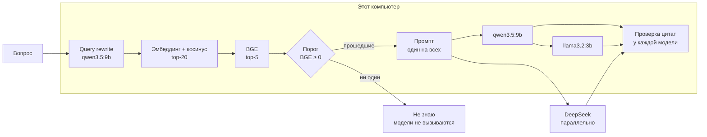

# День 28 — Локальная LLM + RAG

RAG-агент дня 24, переведённый на локальные модели. Ответ, как и раньше, принимается только с дословными
цитатами из найденных фрагментов, иначе «не знаю».

- **Индекс из недели RAG** — тот же SQLite с эмбеддингами `nomic-embed-text` и структурной нарезкой, без пересборки.
- **Retrieval локальный.** Эмбеддинг вопроса в Ollama, косинус по индексу, BGE-реранкер на llama.cpp,
  переформулировка запроса — основной локальной моделью.
- **Генерация локальная** — `qwen3.5:9b` в Ollama.
- **Для сравнения** тот же промпт получают `llama3.2:3b` (модель дня 26) и облачный DeepSeek, если задан ключ.

Без ключа DeepSeek система работает целиком на этом компьютере: запросы не уходят дальше `localhost`.

## Запуск

Нужны JDK 21, Ollama и сервер реранкера на порту 8012 — как в днях 23–25:

```bash
ollama pull nomic-embed-text
ollama pull qwen3.5:9b                 # 6,6 ГБ, основная модель
ollama pull llama3.2:3b                # 2 ГБ, для сравнения

brew install llama.cpp
mkdir -p data/models
curl -fL --retry 3 https://huggingface.co/gpustack/bge-reranker-v2-m3-GGUF/resolve/main/bge-reranker-v2-m3-FP16.gguf -o data/models/bge-reranker-v2-m3-FP16.gguf
llama-server -m data/models/bge-reranker-v2-m3-FP16.gguf --embedding --rerank --pooling rank -c 2048 -b 2048 -ub 2048 --host 127.0.0.1 --port 8012
```

В другом терминале:

```bash
cd day28
cp .env.example .env              # DEEPSEEK_API_KEY — только для облачной колонки
mkdir -p data/corpus              # документы .md с необязательными title и url в YAML
./gradlew :rag-agent:bootRun
```

Сравнение: http://localhost:8290. Замеры: http://localhost:8290/results.html. Трассировки: http://localhost:8290/inside.html.
Корпус, индекс, `.env` и результаты прогонов лежат в `data/` и в репозиторий не входят. Индекс прошлых дней можно
положить в `data/index/knowledge.db` как есть: при тех же настройках нарезки и эмбеддингов он не пересобирается.

## Как проходит вопрос



- **Один поиск — один промпт для всех моделей.** Сравниваются генераторы, а не поиск: фрагменты, номера `[n]`
  и правила у всех одинаковые.
- **Локальные модели отвечают по очереди, облако — параллельно с ними.** Локальные делят один GPU: запущенные
  вместе, они замедлили бы друг друга, и замер скорости стал бы нечестным.
- **У Ollama ответ ограничен JSON-схемой.** В `format` уходит схема `{status, answer, quotes[]}`, Ollama строит
  из неё грамматику, и модель не может написать ничего вне схемы. DeepSeek схему не принимает, у него
  `response_format: json_object` — гарантирован только синтаксис JSON.
- **`think: false`.** `qwen3.5` умеет рассуждать перед ответом; для ответа по готовым фрагментам это лишние
  десятки секунд.
- **Тайминги из ответа Ollama.** Под каждой локальной колонкой время разложено на загрузку модели, обработку
  промпта и генерацию. У облака есть только полное время HTTP-запроса.
- **Ответ и черновик.** Если проверка цитат отклонила ответ, пользователь видит «не знаю», а под ним — что
  написала модель и почему это не прошло.

### Почему окно контекста 8k

Ollama 0.34 по умолчанию открывает модели окно 32 768 токенов и заранее резервирует под него память. На этом
ноутбуке (M1 Pro, 32 ГБ) macOS отдаёт Ollama около 9 ГБ свободной памяти, остальное занято другими программами.
Под `llama3.2:3b` с окном 32k Ollama рассчитала 9,2 ГБ и выгрузила `qwen3.5:9b`, затем наоборот. В итоге
каждый вопрос начинался с холодной загрузки модели (3–5 с), и замер скорости мерил диск, а не генерацию.

Промпт RAG — 0,5–1,5 тыс. токенов, ответ — до 3 тыс. С `num_ctx: 8192` (`local-llm.num-ctx`) обе модели
помещаются в память вместе: 5,4 ГБ и 2,5 ГБ, повторная загрузка — 0,01–0,07 с.

## Три страницы

**Сравнение.** Вопрос → полоса «Поиск локально»: как переписан запрос, сколько заняли переформулировка и поиск,
сколько фрагментов прошло порог. Ниже колонка на каждую модель. Пока модель думает, в колонке идёт таймер;
локальная модель, которая ждёт свою очередь на GPU, так и подписана. Ответ — со ссылками `[n]`, цитатами и шкалой
времени. Шкала общая для всех колонок вопроса, поэтому разница в скорости видна глазами. История диалога
строится по ответам основной модели, уточнения вроде «А когда он не нужен?» переформулируются по ней.

**Замеры.** Результат последнего `tools/eval_compare.py`: по карточке на модель с качеством, скоростью
и стабильностью, затем матрица «вопрос × модель» с исходом каждого прогона. Клик по строке раскрывает ответы
всех моделей в выбранном прогоне рядом с эталоном.

**Внутри агента.** Трассировка дня 24: переформулировка, эмбеддинг, поиск, реранкинг, порог и промпт —
по одному разу, а шаги «Модель» и «Проверка цитат» — для каждой модели, с переключателем.

## Замеры

```bash
python3 tools/eval_compare.py               # 13 вопросов × 3 прогона, около 11 минут
python3 tools/eval_compare.py --summarize   # пересчитать сводку после ручной сверки
```

Вопросы — 10 контрольных из дня 24 (`data/eval/questions.json`), уточнение с историей и два заведомо слабых:
посторонний и «Расскажи про него подробнее» без истории. Каждый вопрос задаётся три раза, все модели получают
один и тот же промпт. Ноутбук M1 Pro 32 ГБ, Ollama 0.34.4, температура 0,2. Ручная сверка с эталоном лежит
в `data/eval/compare-review.json` (верно / частично / неверно); её подхватывают `--summarize` и страница «Замеры».

### Качество

| | qwen3.5:9b | llama3.2:3b | DeepSeek |
|---|---:|---:|---:|
| Ответ с подтверждёнными цитатами, из 27 возможных | **26** | 13 | **27** |
| Отклонено проверкой цитат | 1 | 14 | 0 |
| Сверка с эталоном: верно / частично / неверно | **26 / 0 / 0** | 4 / 7 / 2 | **27 / 0 / 0** |
| «Не знаю» на вопросах без ответа в корпусе | 9/9 | 9/9 | 9/9 |

Возможных ответов 27, а не 30: на одном вопросе поиск промахивается (это известный промах дня 24, лучшая оценка
BGE −6,4), и ни одна модель не вызывается. «Не знаю» на посторонних вопросах решает порог локального поиска ещё
до моделей, поэтому там у всех 9/9.

- **qwen3.5:9b по смыслу не уступает облаку.** Все 26 ответов верны, единственный отказ — цитата из нумерованного
  списка с отступами, которая не совпала с текстом. Артефакты есть: в одном слове латинские буквы вперемешку
  с кириллицей («узela»), в другом кириллическая «А» в «ADR».
- **llama3.2:3b не умеет копировать дословно.** Из 14 отказов 9 — пересказ вместо цитаты, 5 — испорченные символы:
  «×» и «≈» превращаются в «Ð» и «°». Из 13 прошедших проверку верны только 4. Модель обрывает перечисление
  на полуслове, называет три уровня там, где их четыре, дважды отвечает «8.76» — число за год на вопрос про месяц.
  Проверка цитат такое не ловит: цитата настоящая, неверен вывод из неё. Ещё она пишет ответы без ссылок `[n]`
  и вставляет английские слова.
- **DeepSeek** — все 27 ответов, самые полные: чаще сводит вместе несколько фрагментов.

**Ложные отказы в первом прогоне.** Сначала qwen получил 21 ответ из 27, и 3 из 6 отказов оказались ложными.
В сыром ответе Ollama видно, что qwen экранирует перенос строки дважды (`\\n`), и после разбора JSON в цитате
остаются символы `\` и `n`. Сам текст цитаты при этом дословный. `QuoteLocator` и раньше прощал различия
в пробелах, теперь `\n`, `\r` и `\t`, записанные буквами, тоже считаются пробелом. Прогон повторён, в таблице —
результат после правки.

### Скорость

| | qwen3.5:9b | llama3.2:3b | DeepSeek |
|---|---:|---:|---:|
| Ответ модели, медиана / максимум | 14,0 / 23,6 с | 2,7 / 4,9 с | **1,7** / 6,0 с |
| Длина ответа, медиана | 244 ток. | 109 ток. | 284 ток. |
| Скорость генерации | 21 ток/с | 48 ток/с | 137 ток/с сквозная |
| Обработка промпта | 2,3 с, 226 ток/с | 0,2 с, 405 ток/с | — |
| Загрузка модели в замере | ≤ 0,03 с | ≤ 0,01 с | — |

Поиск у всех общий и локальный: переформулировка запроса на qwen — 4,3 с (2,9–7,0), эмбеддинг, косинус и BGE —
0,9 с. Полный путь вопроса в локальной системе — медиана **21 с**.

- **Время уходит на генерацию.** Скорость генерации у модели постоянна, поэтому время растёт с длиной ответа:
  244 токена при 21 ток/с — это около 12 с. Облако генерирует в 6–7 раз быстрее и с сетью укладывается в 1,7 с.
- **Переформулировка запроса на локальной модели дороже всего поиска:** 4,3 с против 0,9 с. В дне 24 она шла
  через DeepSeek и занимала 1,0 с. Если отдать облаку и её, и ответ, вопрос занимает около 3,6 с.
- **llama3.2:3b быстрая, потому что маленькая и отвечает коротко**, но её скорость не окупается качеством.
- **Ollama кэширует общее начало промпта.** Правила (~250 токенов) одинаковы у всех вопросов, и
  `prompt_eval_cached_count` показывает, сколько токенов взято из кэша. Повторный вопрос обрабатывает промпт за 0,1 с.
- **Холодного старта в замере нет:** обе модели держались в памяти (см. «Почему окно контекста 8k»). С диска qwen
  загружается за 3,3–4,7 с, llama — за 2,7–3,4 с.

### Стабильность

| | qwen3.5:9b | llama3.2:3b | DeepSeek |
|---|---:|---:|---:|
| Одинаковый исход во всех трёх прогонах | 12/13 | 8/13 | **13/13** |
| Слово в слово одинаковый ответ | 5/13 | 6/13 | 9/13 |
| Ошибки вызова | 0 | 0 | 0 |
| Разброс времени на одном вопросе, медиана | **4 %** | 37 % | 21 % |

- **Поиск детерминирован.** На всех 13 вопросах во всех прогонах в промпт попали одни и те же фрагменты:
  разница в исходах — только от генерации.
- **qwen стабилен по времени.** Это машина без очереди и сети, разброс 4 %. У облака тот же ответ занимал от 0,9
  до 6,0 с. Во время отладки DeepSeek один раз упал на TLS-рукопожатии (`Remote host terminated the handshake`):
  его колонка показала ошибку, локальные модели ответили.
- **llama нестабильна по исходу.** На 5 вопросах из 13 она то проходит проверку, то нет: цитата получается
  дословной через раз.
- **Одинаковый текст — не цель.** 4 вопроса из 13 — «не знаю» без вызова модели, они совпадают всегда. При
  температуре 0,2 формулировки меняются от прогона к прогону и при одинаковом исходе.

### Итог

На этом корпусе локальный RAG на `qwen3.5:9b` по качеству почти сравнялся с облаком: 26 подтверждённых ответов
против 27, без фактических ошибок, при строгом контракте с дословными цитатами. Цена — время: 21 с на вопрос
против ~3,6 с, когда переформулировку и ответ делает облако. Слабое место локальной системы — не поиск, а скорость генерации на ноутбуке.
Модель на 3 млрд параметров для такого контракта не годится: половина ответов отклонена, а из прошедших верна
только треть.

## Настройки и API

| Переменная | По умолчанию |
|---|---|
| `OLLAMA_CHAT_MODELS` | `qwen3.5:9b,llama3.2:3b` — первая основная: она переписывает запрос и ведёт историю |
| `OLLAMA_BASE_URL`, `OLLAMA_EMBED_MODEL` | `http://localhost:11434`, `nomic-embed-text` |
| `DEEPSEEK_API_KEY`, `DEEPSEEK_MODEL`, `DEEPSEEK_BASE_URL` | пусто — облачной колонки нет; `deepseek-flash` |
| `RERANKER_BASE_URL`, `RERANKER_TIMEOUT` | `http://127.0.0.1:8012`, `120s` |
| `RETRIEVAL_CANDIDATE_K`, `RETRIEVAL_TOP_K`, `RETRIEVAL_MIN_RERANK_SCORE` | 20, 5, 0.0 |
| `QUERY_REWRITE_ENABLED` | `true` |
| `PORT` | 8290 |

Температура 0,2 у всех моделей, `num_ctx` и таймаут локальных — в `application.yml`.

```bash
curl localhost:8290/api/models          # модели: скачана ли, в памяти ли, сколько занимает
curl -N localhost:8290/api/ask -H 'Content-Type: application/json' -d '{"question":"Ваш вопрос по корпусу","history":[]}'
curl localhost:8290/api/evaluation      # последний прогон eval_compare.py
curl localhost:8290/api/traces
```

`/api/ask` отвечает NDJSON-стримом, событие на строку `{"type": …, "data": …}`:

| Событие | Что внутри |
|---|---|
| `retrieval` | Переформулировка, порог, фрагменты в промпте, промпт, список моделей, `traceId` |
| `started` | Модель начала генерацию: `provider`, `model` |
| `answer` | `status` (`answered`, `weak_context`, `no_answer`, `unverified`, `failed`), `answer`, `reason`, `sources`, `quotes`, `llm` с таймингами, `draft` — отклонённый текст |
| `done` / `error` | Конец стрима или ошибка поиска текстом как есть |

Ошибка одной модели не ломает остальные: её колонка получает `failed` с текстом ошибки, например
`Ollama ответила 404 на /api/chat: {"error":"model 'x' not found"}. Скачайте модель: ollama pull x`.

## Тесты

```bash
./gradlew :rag-agent:test :rag-agent:bootJar
```

Тесты дня 24 сохранены. Тест переформулировки переписан под Ollama: схема в `format`, `think: false`,
`num_predict` и `temperature` в `options`, обрезанный ответ (`done_reason: length`) и недоступная модель дают
резервный запрос.
