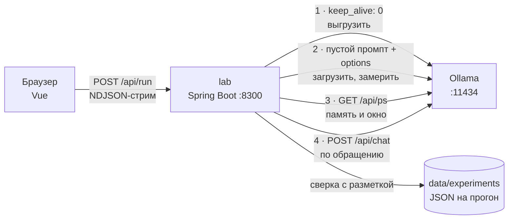

# День 29 — Оптимизация локальной LLM под задачу

Задача: разбирать обращения покупателей интернет-магазина в JSON. По тексту вроде «Списали деньги дважды за заказ
ZK-3301845, 12 490 руб.» модель определяет категорию, чего хочет клиент, срочность, номер заказа и сумму.
Модель — `llama3.2:3b` в Ollama на этом компьютере.

**Лаборатория** — веб-песочница для настройки. В ней меняются модель и квантование, промпт-шаблон, примеры,
JSON-схема и параметры. Каждый прогон по размеченному набору меряет качество, скорость и память модели
и сохраняется в журнал, где любые два прогона сравниваются рядом.

Итог на контрольных обращениях, которые при настройке не использовались:

| | Из коробки | Настроенная | |
|---|---:|---:|---|
| Поля верно | 53% | **96%** | ×1,8 |
| Обращение разобрано целиком верно | 3 из 20 | **17 из 20** | |
| Валидный JSON | 17 из 20 | **20 из 20** | |
| Время на обращение, медиана | 2,35 с | **0,65 с** | в 3,6 раза быстрее |
| Время, p90 | 6,32 с | **0,73 с** | |
| Память модели | 4,3 ГБ | **2,2 ГБ** | вдвое меньше |

Для сравнения: `qwen3.5:9b` с той же настройкой — 99% полей, но 3,6 с на обращение и 6,1 ГБ памяти.

Результат дня — модель `triage:3b`: промпт, примеры и параметры записаны в неё, `ollama run triage:3b` разбирает
обращения сразу. Её [Modelfile](Modelfile) лежит рядом.

## Запуск

```bash
ollama pull llama3.2:3b                      # 2 ГБ, Q4_K_M — основная модель
# Для сравнения квантований и потолка (необязательно):
ollama pull llama3.2:3b-instruct-q2_K        # 1,4 ГБ
ollama pull llama3.2:3b-instruct-q8_0        # 3,4 ГБ
ollama pull llama3.2:3b-instruct-fp16        # 6,4 ГБ
ollama pull qwen3.5:9b                       # 6,6 ГБ

cd day29
./gradlew :lab:bootRun
```

Открыть http://localhost:8300. Нужны JDK 21 и запущенная Ollama. Журнал прогонов пишется в `data/experiments`,
в репозиторий он не входит.

Собрать модель без лаборатории:

```bash
ollama create triage:3b -f Modelfile
ollama run triage:3b "Заказ 8840126 — подарок на завтра, курьер не звонил. Привезут?"
```

## Задача и набор

Ответ — JSON из пяти полей:

| Поле | Значения |
|---|---|
| `category` | `delivery` — заказ ещё не получен, `return` — возврат без брака, `defect` — брак или не тот товар, `payment` — деньги, `account` — личный кабинет, `product` — вопрос до покупки |
| `action` | `track`, `cancel`, `refund`, `exchange`, `fix`, `info` |
| `urgency` | `high` — деньги списаны дважды, угроза жалобой, опасный товар, взлом, «пишу третий раз», нужно сегодня или завтра; `low` — только вопрос; иначе `medium` |
| `order_id` | номер заказа как написан, `null` если его нет |
| `amount` | сумма в рублях числом, `null` если её нет |

Набор — 40 размеченных обращений в [`lab/src/main/resources/task/tickets.json`](lab/src/main/resources/task/tickets.json),
написаны для этого дня. Набор поделён пополам:

- **Настройка** (`t01`–`t20`) — на ней подбирались промпт и примеры;
- **Контроль** (`c01`–`c20`) — на ней не подбиралось ничего. Все цифры в этом README — с контроля. Если подбирать
  промпт и мерить на одних и тех же 20 обращениях, промпт подгоняется под них, и «после» выглядит лучше, чем есть.

В обращениях есть ловушки: телефон и трек-номер рядом с номером заказа, «42 размер», «350 баллов» и «24 см» рядом
с суммой, «индикатор не горит» рядом с правилом про горящий товар, «сегодня уже 9-е» рядом с правилом
«нужно сегодня», «сняли 26 980 вместо 13 490 — верните лишние 13 490».

**Как считается качество.** Ответ должен быть JSON-объектом с ключами из задания, значения перечислений — ровно
из списка. Если JSON обёрнут в ```` ```json ```` или вокруг есть текст, берётся первый объект целиком. Нестрогое только
написание: «№ ZK-4471209» и «zk4471209» — один номер, «12 490» строкой и 12490 числом — одна сумма. «Целиком верно» —
все пять полей совпали с разметкой.

## Лаборатория

Слева — конфигурация. Она общая для всех вкладок:

- **Пресет**: «Из коробки», «Настроенный» или «Собранная» (для модели, собранной кнопкой ниже). После ручной правки
  появляется плашка «изменена».
- **Модель** из `ollama list`: размер, квантование и объём файла.
- **Промпт-шаблон**: системный промпт, переключатель «Примеры» (4 пары «обращение → ответ» перед текстом)
  и переключатель «JSON-схема в format». Для qwen есть ещё переключатель рассуждений (`think`).
- **Параметры**: `temperature`, `top_p`, `num_ctx`, `num_predict`. Пустое поле не отправляется, и Ollama берёт
  значение из Modelfile модели, а если его там нет — своё. Подсказка в пустом поле показывает, какое именно:
  у `llama3.2` своих параметров нет (0,8 и 0,9 от Ollama), у `qwen3.5` — temperature 1 и top_p 0,95.
- **Что уйдёт в Ollama** — тело `POST /api/chat`.
- **Собрать модель** — `ollama create` из текущей конфигурации.

Вкладки:

- **Прогон по набору.** Перед прогоном модель выгружается и загружается заново с выбранными параметрами. Так время
  загрузки и память из `/api/ps` меряются одинаково для каждого прогона. Затем обращения идут по одному,
  результат каждого сразу появляется в таблице: значение модели, ✓ или ✗, а при ошибке — что было в разметке.
  Плитки сверху пересчитываются на лету. Клик по строке показывает ответ модели как есть. Режим ×3 повторяет
  набор трижды и считает стабильность.
- **Свой текст.** Одно обращение: из набора (тогда со сверкой) или своё.
- **Журнал.** Все прогоны с выбранного набора: график «качество × время» и таблица. Два прогона, A и B, сравниваются
  по всем метрикам с разницей. Ниже — обращения, на которых их ответы разошлись.



## Что дал каждый рычаг

Рычаги включались по одному, контрольный набор, `llama3.2:3b` Q4_K_M:

| Конфигурация | Поля | Целиком | JSON | Медиана | Ответ | Память |
|---|---:|---:|---:|---:|---:|---:|
| Из коробки: наивный промпт, параметры модели | 53% | 3 | 17 | 2,35 с | 105 ток. | 4,3 ГБ |
| + правила в промпте | 63% | 5 | 16 | 1,01 с | 41 ток. | 4,3 ГБ |
| + 4 примера | 93% | 14 | 20 | 0,65 с | 26 ток. | 4,2 ГБ |
| + JSON-схема в `format` | 94% | 16 | 20 | 0,65 с | 26 ток. | 4,2 ГБ |
| + `temperature 0` | 96% | 17 | 20 | 0,65 с | 26 ток. | 4,2 ГБ |
| + `num_ctx 2048`, `num_predict 128` — **настроенная** | **96%** | **17** | **20** | **0,65 с** | 26 ток. | **2,2 ГБ** |
| Для сравнения: наивный промпт + только схема | 65% | 4 | 20 | 0,86 с | 38 ток. | 4,2 ГБ |

- **Примеры дали больше всего: +30 п.п.** Маленькая модель плохо применяет правила из текста, а по образцу
  отвечает уверенно. Правила без примеров добавили 10 п.п., и модель всё ещё писала пояснения вокруг JSON.
- **Схема делает JSON валидным, но не делает ответ верным.** Наивный промпт со схемой — 20 из 20 валидных
  объектов, но 65% полей. Ollama строит из схемы грамматику, и модель не может выйти за перечисления. Понимания
  это не добавляет.
- **Ускорение — от короткого ответа, а не от параметров.** Скорость генерации у модели постоянная, ~50 ток/с.
  «Из коробки» модель отвечает рассуждениями на 105 токенов, а настроенная — голым JSON на 26.
  Отсюда 2,35 с → 0,65 с.
- **Промпт стал в 6,6 раза длиннее, но не медленнее.** У настроенной модели 955 токенов промпта против 145. Правила
  и примеры одинаковы у всех обращений, и Ollama берёт из кэша 916 из них. Обрабатываются только ~40 токенов
  самого обращения.
- **Окно контекста — это память, а не качество.** Ollama 0.34 открывает модели окно 32 768 токенов и заранее
  резервирует под него KV-кэш. Промпту нужно ~1000 токенов. С `num_ctx 2048` модель занимает 2,2 ГБ вместо 4,3 ГБ,
  качество то же. С `num_ctx 1024` — тоже 96% и 2,1 ГБ, но запаса почти нет: 955 токенов промпта и 26 ответа.
  Длинное обращение уже не поместится, поэтому выбрано 2048.
- **`num_predict 128`** — потолок на случай, если модель начнёт рассуждать. JSON из пяти полей — 24–30 токенов.

### Где настроенная ошибается

Четыре поля из 100 на контроле:

- **c01, c17 — `high` вместо `medium`.** «Висит в статусе уже неделю» и «передумал насчёт гриля» — ни одного признака
  срочности из правил, но модель всё равно ставит `high`.
- **c11 — `return` вместо `defect`.** «Прислали не тот товар» по правилам — брак, модель решила, что это возврат.
- **c11 — `order_id: "ZK-7710452"`, хотя в обращении номера нет.** Это номер из второго примера в промпте: модель
  скопировала его в ответ. Цена few-shot — значения из примеров иногда протекают в ответы.

### Что пробовал и откатил

На наборе «Настройка», `temperature 0`, так что разница между вариантами не случайна:

| Вариант | Поля |
|---|---:|
| Исходные правила + 4 примера — **оставлен** | **94%** |
| Строже правило срочности: «по умолчанию medium, high — только если прямо сказано…» | 93% |
| 6 примеров вместо 4: добавлены два «возмущённых» с обычной срочностью | 91% |
| Те же правила по-английски | 92% |

Ни одна правка не помогла. Шестой пример даже сломал t19: модель написала сумму 7740 вместо 7490.
Слабое место 3B-модели — срочность: она ставит `high` за восклицательные знаки и обычную поломку.

## Квантование

Настроенная конфигурация, контрольный набор, окно 2048:

| | q2_K | **q4_K_M** | q8_0 | fp16 |
|---|---:|---:|---:|---:|
| Файл | 1,4 ГБ | **2,0 ГБ** | 3,4 ГБ | 6,4 ГБ |
| Память после загрузки | 1,6 ГБ | **2,2 ГБ** | 3,6 ГБ | 6,6 ГБ |
| Поля верно | 75% | **96%** | 96% | 95% |
| Целиком верно | 6 | **17** | 17 | 16 |
| Время, медиана | 0,57 с | **0,65 с** | 0,88 с | 1,16 с |
| Генерация | 57 ток/с | **50 ток/с** | 37 ток/с | 25 ток/с |
| Загрузка, файл в кэше ОС | 0,8 с | 0,8 с | 0,8–1,1 с | 1,1 с |

- **q4_K_M — точка равновесия.** q8_0 и fp16 по качеству не лучше, но медленнее и занимают в 1,6–3 раза больше памяти.
  Генерация на M1 Pro упирается в пропускную способность памяти, поэтому чем больше весит модель, тем медленнее
  каждый токен.
- **Время загрузки зависит от кэша, а не от квантования.** Когда файл модели уже лежит в кэше ОС, все четыре варианта
  загружаются за 0,8–1,1 с. Первая загрузка с диска в прогонах заняла 2,1 с у q2_K, 6,3 с у fp16 и 25,5 с у q8_0.
- **q2_K ломает понимание, а не формат.** JSON валиден везде, схема держит структуру. Но срочность верна в 11 случаях
  из 20, а действие — в 14. Выигрыш — 0,7 ГБ и 0,08 с, качество падает на 21 п.п.

## Потолок: qwen3.5:9b

Та же настроенная конфигурация, `think: false`:

| | llama3.2:3b, настроенная | qwen3.5:9b, настроенная |
|---|---:|---:|
| Поля верно | 96% | **99%** |
| Целиком верно | 17 | **19** |
| Время, медиана | **0,65 с** | 3,64 с |
| Генерация | **50 ток/с** | 22 ток/с |
| Память | **2,2 ГБ** | 6,1 ГБ |

9B-модель ошиблась в одном поле из 100, 3B — в четырёх. Зато 3B отвечает в 5,6 раза быстрее и занимает
в 2,8 раза меньше памяти. Для разбора потока обращений это разумный размен.

## Стабильность

Каждый вариант прогнан три раза подряд на контрольном наборе — 60 ответов:

| | Из коробки | Настроенная |
|---|---:|---:|
| Поля верно | 50% (149 из 300) | **96%** (288 из 300) |
| Целиком верно | 10 из 60 | **51 из 60** |
| Валидный JSON | 48 из 60 | **60 из 60** |
| Обращения с одинаковым ответом во всех трёх повторах | 3 из 20 | **20 из 20** |
| Время, p90 | 6,66 с | **0,72 с** |

- **Без `temperature 0` один прогон «из коробки» ничего не говорит.** У `llama3.2` в Modelfile температуры нет,
  поэтому Ollama ставит 0,8. Одинаковый ответ во всех трёх повторах — только у 3 обращений из 20. На наборе
  «Настройка» два одиночных прогона одной и той же конфигурации дали 52% и 44%.
- **С `temperature 0` ответ детерминирован:** 20 из 20 обращений — слово в слово тот же JSON. Поэтому разницу
  между вариантами промпта в 1–2 п.п. можно считать настоящей, а не случайной.
- **p90 «из коробки» — 6,7 с.** Модель иногда пишет вместо JSON целое рассуждение на 300–400 токенов.

## Собранная модель

Кнопка «Собрать модель» вызывает `POST /api/create`. Системный промпт, примеры и параметры записываются
в модель. Модель `triage:3b` из настроенной конфигурации:

```
FROM llama3.2:3b
PARAMETER temperature 0.0
PARAMETER num_ctx 2048
PARAMETER num_predict 128
SYSTEM """…правила из lab/src/main/resources/task/prompt-optimized.txt…"""
MESSAGE user Здравствуйте, заказ 5512093 должны были привезти вчера…
MESSAGE assistant {"category":"delivery","action":"track","urgency":"medium","order_id":"5512093","amount":null}
…ещё три пары…
```

Прогон `triage:3b` на контрольном наборе с пресетом «Собранная», то есть только обращение и схема, совпал
с настроенной конфигурацией до токена: 96% полей, те же три ошибки, те же 955 токенов промпта, 916 из кэша. Значит,
Ollama подставляет системный промпт и `MESSAGE` из модели в каждый `/api/chat`. В пустых полях параметров
лаборатория показывает зашитые в модель значения: `0`, `2048`, `128`.

```bash
$ ollama run triage:3b "Заказ 8840126 — подарок на завтра, курьер не звонил. Привезут?"
{"category":"delivery","action":"track","urgency":"high","order_id":"8840126","amount":null}
```

**JSON-схему в модель не записать.** В Modelfile нет инструкции для `format`, схему передаёт клиент в каждом
запросе. Пресет «Собранная» так и делает: отправляет только обращение и схему. Без схемы `ollama run`
всё равно отвечает JSON: этому модель учат примеры.

## Настройки и API

| Переменная | По умолчанию |
|---|---|
| `OLLAMA_BASE_URL` | `http://localhost:11434` |
| `PORT` | `8300` |

| Метод | Что делает |
|---|---|
| `GET /api/task` | набор с разметкой, примеры, пресеты, JSON-схема |
| `GET /api/models` | модели из Ollama, которые генерируют текст: квантование, размер, умеет ли рассуждать |
| `GET /api/status` | версия Ollama и загруженные модели с памятью и окном |
| `POST /api/run` | прогон по набору, NDJSON: `start` → `loaded` → `item`… → `done` или `error` |
| `POST /api/try` | одно обращение |
| `GET/DELETE /api/experiments[/{id}]` | журнал |
| `POST /api/build` | собрать модель: `{name, config}` |

Прогоны идут по очереди: второй, пока идёт первый, получает 409. Два прогона на одном GPU замедлили бы
друг друга, и замер скорости стал бы нечестным.

Ноутбук: M1 Pro, 32 ГБ, Ollama 0.34.4.
