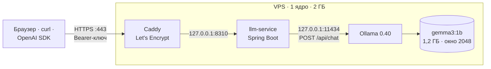

# День 30 — Приватный AI-сервис на локальной LLM

`gemma3:1b` работает в Ollama на VPS: 1 ядро, 2 ГБ памяти, без видеокарты. Перед моделью стоит сервис на
Spring Boot с OpenAI-совместимым API. Он проверяет ключ доступа, лимит запросов, очередь к модели и окно контекста.
Наружу смотрит только Caddy с HTTPS. Ollama и сервис слушают `127.0.0.1`.

Адрес — `https://<IP через дефисы>.sslip.io`: для VPS 203.0.113.10 это `https://203-0-113-10.sslip.io`.
Там веб-чат и панель сервиса, API — по тому же адресу, `/v1/...`.
Ключи лежат на сервере: `ssh user@203.0.113.10 sudo cat /etc/llm-service.env`.



## API

Подмножество OpenAI Chat Completions. Работает с curl, OpenAI SDK и любым клиентом, где можно задать `base_url`.

```bash
KEY=…   # из /etc/llm-service.env
curl https://203-0-113-10.sslip.io/v1/chat/completions \
  -H "Authorization: Bearer $KEY" -H "Content-Type: application/json" \
  -d '{"messages":[{"role":"user","content":"Кто написал «Войну и мир»?"}],"max_tokens":40}'
```

```json
{"id":"chatcmpl-…","model":"gemma3:1b",
 "choices":[{"index":0,"message":{"role":"assistant","content":"Лев Толстой."},"finish_reason":"stop"}],
 "usage":{"prompt_tokens":44,"completion_tokens":6,"total_tokens":50},
 "timings":{"queue_ms":4,"first_token_ms":1277,"prompt_ms":1035,"generation_ms":583,"tokens_per_second":10.3,"cached_prompt_tokens":0}}
```

`"stream": true` — ответ по токену в SSE, как у OpenAI: кусок с ролью, куски текста, последний кусок
с `finish_reason`, `usage` и `timings`, затем `data: [DONE]`. `timings` в OpenAI нет — это поле сервиса.
Оно показывает, сколько запрос ждал в очереди, когда пришёл первый токен и с какой скоростью шла генерация.

```python
from openai import OpenAI

client = OpenAI(base_url="https://203-0-113-10.sslip.io/v1", api_key=KEY)
for chunk in client.chat.completions.create(model="gemma3:1b", stream=True,
        messages=[{"role": "user", "content": "Назови три языка программирования."}]):
    print(chunk.choices[0].delta.content or "", end="")
```

`GET /v1/models` возвращает модель и её окно контекста. `GET /api/status` — состояние для панели: очередь,
остаток лимита ключа, память сервера и журнал последних запросов от всех клиентов.

## Ограничения

| Что | Значение | Что получает клиент сверх лимита |
|---|---|---|
| Ключ доступа | `Authorization: Bearer …`, ключи в `/etc/llm-service.env` | 401 `invalid_api_key` |
| Rate limit | 10 запросов за 60 с на ключ, скользящее окно | 429 `rate_limit_exceeded`, `Retry-After` |
| Очередь | 1 ответ генерируется, 3 ждут | 503 `queue_full` сразу, без ожидания |
| Окно контекста | 2048 токенов, считает Ollama токенизатором модели | 400 `context_length_exceeded` с числом токенов |
| Длина ответа | `max_tokens` ≤ 512 | больше урезается, на пределе `finish_reason: length` |

Каждый ответ несёт остаток лимита в заголовках с именами как у OpenAI: `X-RateLimit-Limit-Requests`,
`X-RateLimit-Remaining-Requests`, `X-RateLimit-Reset-Requests`. Ошибки приходят в формате OpenAI
(`{"error": {"message", "type", "code"}}`), и SDK разбирает их сам: `BadRequestError` с кодом
`context_length_exceeded`, `AuthenticationError`, `RateLimitError`.

Числа подобраны под железо:

- **Одна генерация за раз.** На одном ядре два параллельных ответа идут вдвое медленнее каждый, а память под
  контекст удваивается. Остальные ждут в очереди сервиса.
- **Очередь на 3.** Без неё запросы копятся в очереди Ollama на 512 мест: соединения висят минутами, и клиент
  не знает, ждать ему или нет. С очередью четвёртый ожидающий сразу получает 503.
- **10 запросов в минуту на ключ.** Модель выдаёт ~11 токенов в секунду, ответ в 100–150 токенов — это
  10–15 с. За минуту сервер успевает ответить 4–6 раз, так что 10 запросов на ключ — это уже больше, чем
  пропускная способность всего сервера.
- **Окно 2048.** Промпт модель на этом процессоре читает со скоростью ~47 токенов в секунду. Полное окно
  в 1938 токенов обрабатывалось 41,6 с. Окно 4096 удвоило бы и это время, и память под контекст.

## Выбор модели

Все кандидаты прогнаны на этом VPS с окном 2048 и одинаковым системным промптом.

| Модель | Генерация | Память | Факты, из 8 | Как отвечает |
|---|---:|---:|---:|---|
| gemma3:270m | 38 ток/с | 0,54 ГБ | — | на «что такое HTTP API» рассказывает о себе |
| qwen2.5:0.5b | 19–20 ток/с | 0,62 ГБ | 5 | «Война и мир» — Пушкин |
| qwen3:0.6b, без рассуждений | 17–20 ток/с | 0,79 ГБ | 4 | «Столица Японии — Японея», столица Италии — Милан |
| **gemma3:1b** | **10–12 ток/с** | **1,24 ГБ** | **7** | Рим, Токио, Лев Толстой; ошиблась только с цветом неба |

Модели меньше миллиарда параметров быстрее, но по-русски путают простые факты. Понижение temperature до 0,2
не помогло. gemma3:1b вдвое медленнее, зато отвечает по делу, и это решило выбор. Цена — память: на машине
с 2 ГБ модели нужно 1,24 ГБ. Параметр `num_batch` память не уменьшает: с 64 вместо 512 стало 1,19 ГБ.

Сменить модель: `LLM_MODEL=qwen3:0.6b deploy/deploy.sh user@203.0.113.10`.

## Проверки

### Доступ по сети

- Снаружи открыты только 80 и 443, на обоих Caddy, сертификат Let's Encrypt, HTTP/2. HTTP перенаправляется
  на HTTPS (308).
- `11434` (Ollama) и `8310` (сервис) слушают `127.0.0.1`. С самого VPS на публичный IP — «Could not connect».
- Без ключа и с чужим ключом — 401. С Mac через интернет работают curl, OpenAI SDK и веб-страница.

### Несколько запросов одновременно

8 запросов разом, время по журналу сервиса:

| | Запросов | Ожидание в очереди | Всего |
|---|---:|---|---|
| Сразу генерируется | 1 | 0 с | 4,4 с |
| Ждут в очереди | 3 | 4,4 · 6,9 · 7,2 с | 6,9 · 7,6 · 7,8 с |
| Очередь полна → 503 | 4 | — | 0–14 мс |

После прогона сервис отвечает как обычно, память не растёт: JVM 88 → 99 МБ.

Перезапуски: если остановить Ollama, сервис отвечает 502 `model_unavailable` с текстом ошибки и не падает.
Когда Ollama возвращается, модель загружается на первом запросе. После `kill -9` systemd поднимает сервис
за ~10 с, и тот сам прогревает модель.

### Rate limit и окно контекста

- Ключ `owner` исчерпал 10 запросов, 11-й получил 429 с `Retry-After: 8`. Ключ `guest` в ту же секунду
  ответил 200: лимит у каждого ключа свой.
- Текст на 12 960 символов — 3259 токенов. Ответ 400 «Окно модели — 2048 токенов, а запрос занимает 3259»
  пришёл за 0,3 с, генерация не начиналась. То же при `stream: true`: отказ приходит обычным HTTP-статусом,
  потому что сервис пишет первый байт стрима, только когда модель приняла запрос.
- Без `truncate: false` Ollama молча режет промпт: из 4517 токенов модель получила 1026, остальное отброшено,
  и ответ строится по обрывку. Клиент об этом не узнаёт: статус 200.

## Веб-страница

Слева чат со стримингом. Под каждым ответом — токены, скорость, ожидание в очереди, первый токен и полное время.
Индикатор над чатом показывает, сколько окна займёт история в следующем запросе. Справа — панель сервиса:
очередь, остаток лимита ключа, окно и память сервера обновляются раз в 1,5 с. Есть три проверки из задания —
«6 запросов разом», «Длинный контекст», «Rate limit» — и журнал запросов от всех клиентов, включая curl.

Ключ вводится один раз и хранится в `localStorage` этого браузера. Ответы модели экранируются, из Markdown
размечаются только жирный шрифт, заголовки и списки.

## Как устроено

- **Порядок проверок.** Ключ → лимит ключа → место в очереди → окно контекста → генерация. Всё, что отказано
  до генерации, получает обычный HTTP-статус.
- **Окно считает Ollama.** Сервис шлёт `truncate: false` и `shift: false`. Ollama токенизирует промпт и
  отказывает до генерации, если он не помещается. Свой подсчёт токенов в сервисе разошёлся бы с токенизатором
  модели: у gemma3 на токен приходится ~4 символа русского текста, у qwen3 — ~3.
- **Одинаковые настройки у всех запросов.** `num_ctx`, `truncate` и `shift` у каждого запроса одни и те же:
  если их поменять, Ollama перезагружает модель (2 с). По той же причине сервис прогревает модель при старте
  настоящим `/api/chat` с этими флагами: после прогрева пустым промптом в `/api/generate` первый чат всё равно
  перезагружал модель.
- **Клиент ушёл — генерация остановилась.** Сервис закрывает стрим Ollama, и она прекращает считать ответ.
- **Ключи** сравниваются за постоянное время, хранятся в `/etc/llm-service.env` с правами 600 и в репозиторий
  не попадают. Сервис работает под системным пользователем `llm` с `ProtectSystem=strict`.

### Память

| Процесс | RAM | swap |
|---|---:|---:|
| llama-server (gemma3:1b) | 832 МБ | 373 МБ |
| Java (llm-service, `-Xmx128m`) | 144 МБ | 10 МБ |
| ollama | 22 МБ | 2 МБ |
| caddy | 7 МБ | 2 МБ |

Свободно ~620 МБ. Swap на 2 ГБ — страховка от OOM. В swap лежит та часть буферов модели, которая нужна
только длинным промптам. Короткий запрос получает первый токен за 0,3–0,6 с. После рестарта Ollama первые
запросы идут медленно, 4–11 с до первого токена, пока страницы модели возвращаются из swap. Поэтому
`deploy.sh` перезапускает Ollama, только когда поменялись её настройки.

## Запуск

Локально (нужны JDK 21 и Ollama с `ollama pull gemma3:1b`):

```bash
cd day30
API_KEYS=owner:dev-key ./gradlew :llm-service:bootRun
```

Открыть http://localhost:8310 и ввести ключ `dev-key`.

На VPS с Ubuntu — одной командой с локальной машины:

```bash
day30/deploy/deploy.sh user@203.0.113.10
```

Скрипт собирает jar, ставит Ollama, Java 21 и Caddy, создаёт swap, пользователя `llm` и ключи (только при
первом запуске), раскладывает systemd-юниты и Caddyfile. Повторный запуск обновляет сервис, ключи не трогает.

| Переменная | По умолчанию |
|---|---|
| `API_KEYS` | — обязательно, `имя:ключ` через запятую |
| `LLM_MODEL` | `gemma3:1b` |
| `LLM_CONTEXT_TOKENS` | `2048` |
| `LLM_MAX_OUTPUT_TOKENS` | `512` |
| `RATE_LIMIT_REQUESTS` / `RATE_LIMIT_WINDOW` | `10` / `1m` |
| `QUEUE_PARALLEL` / `QUEUE_MAX_WAITING` | `1` / `3` |
| `OLLAMA_BASE_URL` | `http://localhost:11434` |
| `SERVER_ADDRESS` / `PORT` | `127.0.0.1` / `8310` |

## Файлы

```
day30/
├── llm-service/src/main/kotlin/advent/llmservice/
│   ├── LlmServiceApplication.kt      настройки, ключи, бины
│   ├── api/                          /v1/chat/completions и /v1/models, ошибки в формате OpenAI
│   ├── limits/                       ключ доступа, rate limit, очередь к модели
│   ├── ollama/                       клиент /api/chat со стримом, модель и прогрев
│   └── status/                       /api/status и журнал запросов
├── llm-service/src/main/resources/static/index.html   чат и панель сервиса
└── deploy/
    ├── deploy.sh                     выкладка на VPS
    ├── llm-service.service           systemd-юнит сервиса
    ├── ollama.conf                   настройки Ollama: одна модель, одна генерация, не выгружать
    └── Caddyfile                     HTTPS и проксирование на сервис
```
